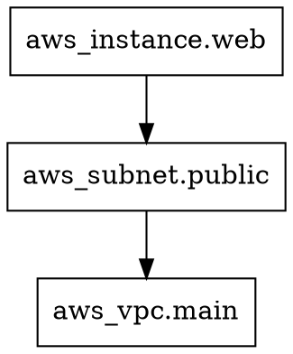

# Hands-On 3.6 --- Extending Terraform

**File:** `main.tf`, debug session, graph analysis

---

## Concept

Terraform is more than `init/plan/apply`. Under the hood it builds a **dependency graph**, communicates with providers via a **plugin protocol**, and offers extensive **debugging** capabilities. Understanding these internals helps you troubleshoot complex failures and design better module compositions.

```
  terraform plan
       |
       v
  Parse HCL files
       |
       v
  Build Resource Graph (DAG)
       |
       v
  Walk graph in parallel
       |
       v
  Call Provider Plugins (gRPC)
       |
       v
  Compare with State
       |
       v
  Generate Execution Plan
```

---

## 1. Advanced Module Composition

### Pattern: Hub-and-Spoke

```
Root Module (orchestrator)
    |
    +-- module "network"    (VPC, subnets, routes)
    |       |
    |       +-- outputs: vpc_id, subnet_ids
    |
    +-- module "security"   (SGs, NACLs, IAM)
    |       |
    |       +-- inputs:  vpc_id (from network)
    |       +-- outputs: sg_ids
    |
    +-- module "compute"    (EC2, ASG, ALB)
            |
            +-- inputs:  vpc_id, subnet_ids, sg_ids
            +-- outputs: alb_dns
```

```hcl
# Root main.tf - module composition
module "network" {
  source   = "./modules/network"
  vpc_cidr = "10.0.0.0/16"
  azs      = ["us-east-1a", "us-east-1b"]
}

module "security" {
  source = "./modules/security"
  vpc_id = module.network.vpc_id
}

module "compute" {
  source     = "./modules/compute"
  vpc_id     = module.network.vpc_id
  subnet_ids = module.network.public_subnet_ids
  sg_ids     = module.security.web_sg_ids
}

output "app_url" {
  value = module.compute.alb_dns
}
```

### Pattern: Factory Module (for_each + modules)

```hcl
variable "services" {
  default = {
    api = {
      instance_type = "t3.small"
      port          = 8080
      replicas      = 2
    }
    web = {
      instance_type = "t3.micro"
      port          = 80
      replicas      = 3
    }
    worker = {
      instance_type = "t3.medium"
      port          = 0
      replicas      = 1
    }
  }
}

module "service" {
  source   = "./modules/service"
  for_each = var.services

  name          = each.key
  instance_type = each.value.instance_type
  port          = each.value.port
  replicas      = each.value.replicas
  vpc_id        = module.network.vpc_id
  subnet_ids    = module.network.private_subnet_ids
}

output "service_endpoints" {
  value = { for k, v in module.service : k => v.endpoint }
}
```

### Pattern: Conditional Module

```hcl
variable "enable_monitoring" {
  type    = bool
  default = false
}

module "monitoring" {
  source = "./modules/monitoring"
  count  = var.enable_monitoring ? 1 : 0

  vpc_id     = module.network.vpc_id
  cluster_id = module.compute.cluster_id
}

# Access with: module.monitoring[0].dashboard_url (when enabled)
```

---

## 2. Backend Types and Selection

The backend determines where Terraform stores its state file.

| Backend | Use Case | Locking | Encryption |
|---------|----------|---------|------------|
| `local` | Solo development | File-based | No |
| `s3` | AWS teams (most common) | DynamoDB | Yes (SSE) |
| `gcs` | GCP teams | Built-in | Yes |
| `azurerm` | Azure teams | Built-in | Yes |
| `consul` | HashiCorp stack | Built-in | Yes |
| `remote` | Terraform Cloud/Enterprise | Built-in | Yes |
| `http` | Custom HTTP endpoint | Varies | Varies |
| `pg` | PostgreSQL database | Built-in | TLS |

### S3 Backend Best Practice

```hcl
terraform {
  backend "s3" {
    bucket         = "mycompany-terraform-state"
    key            = "environments/prod/network/terraform.tfstate"
    region         = "us-east-1"
    dynamodb_table = "terraform-state-locks"
    encrypt        = true

    # Optional: use a specific KMS key
    # kms_key_id = "arn:aws:kms:us-east-1:123456789:key/abc-123"
  }
}
```

### State Key Naming Convention

```
s3://mycompany-terraform-state/
  environments/
    dev/
      network/terraform.tfstate
      compute/terraform.tfstate
      database/terraform.tfstate
    staging/
      network/terraform.tfstate
      compute/terraform.tfstate
    prod/
      network/terraform.tfstate
      compute/terraform.tfstate
      database/terraform.tfstate
```

> **Tip:** Split state by blast radius. Network, compute, and database should be separate state files so a mistake in compute does not affect the database.

---

## 3. Plugin Protocol Overview

Terraform providers are separate binaries that communicate over gRPC.

```
terraform (core)
     |
     | gRPC over localhost
     |
     v
provider-aws (plugin binary)
     |
     | HTTPS API calls
     |
     v
AWS APIs (ec2, s3, iam, etc.)
```

### Plugin Lifecycle

```
1. terraform init
   - Reads required_providers block
   - Downloads provider binaries from registry.terraform.io
   - Stores in .terraform/providers/

2. terraform plan / apply
   - Core starts provider as a subprocess
   - Establishes gRPC connection
   - Sends schema requests, diff requests, apply requests
   - Provider translates to API calls
   - Results sent back over gRPC

3. terraform finishes
   - Provider process terminates
```

### Provider Cache

```bash
# See downloaded providers
ls -la .terraform/providers/registry.terraform.io/hashicorp/

# Output:
# aws/5.40.0/linux_amd64/terraform-provider-aws_v5.40.0_x5
```

You can share a provider cache across projects:

```bash
# Set up a global plugin cache
export TF_PLUGIN_CACHE_DIR="$HOME/.terraform.d/plugin-cache"
mkdir -p "$TF_PLUGIN_CACHE_DIR"

# Now terraform init will check the cache before downloading
terraform init
```

---

## 4. Debugging with TF_LOG

### Log Levels

| Level | What it shows |
|-------|--------------|
| `TRACE` | Everything (extremely verbose) |
| `DEBUG` | Detailed internal operations |
| `INFO` | General operation flow |
| `WARN` | Potential problems |
| `ERROR` | Errors only |

### Enabling Debug Logging

```bash
# Set log level (session-wide)
export TF_LOG=DEBUG

# Run terraform with debug output
terraform plan

# To log to a file instead of stderr
export TF_LOG_PATH="./terraform-debug.log"
terraform plan

# Provider-specific logging
export TF_LOG_PROVIDER=TRACE
terraform plan

# Core-only logging (exclude provider noise)
export TF_LOG_CORE=DEBUG
terraform plan

# Disable logging
unset TF_LOG
unset TF_LOG_PATH
unset TF_LOG_PROVIDER
unset TF_LOG_CORE
```

### Hands-On: Debug a Plan

```bash
mkdir -p ~/debug-lab && cd ~/debug-lab

cat > main.tf << 'EOF'
terraform {
  required_providers {
    aws = {
      source  = "hashicorp/aws"
      version = "~> 5.0"
    }
  }
}

provider "aws" {
  region = "us-east-1"
}

resource "aws_instance" "test" {
  ami           = "ami-0c55b159cbfafe1f0"
  instance_type = "t3.micro"
  tags = {
    Name = "debug-test"
  }
}
EOF

# Initialize
terraform init

# Run plan with DEBUG logging to a file
TF_LOG=DEBUG TF_LOG_PATH=./debug.log terraform plan

# Examine the log
grep -i "provider" debug.log | head -20
```

Expected log entries:
```
2024-03-15T10:00:01.234Z [DEBUG] provider: starting plugin: path=.terraform/providers/...
2024-03-15T10:00:01.345Z [DEBUG] provider: plugin started: pid=12345
2024-03-15T10:00:01.456Z [DEBUG] provider.terraform-provider-aws: configuring server...
2024-03-15T10:00:02.789Z [DEBUG] provider.terraform-provider-aws: API request: service=EC2 operation=DescribeInstances
```

### Reading Debug Output

Key patterns to look for:

```
[ERROR]    -- Something broke, start here
[WARN]     -- Might be the cause of subtle issues
provider:  -- Provider communication issues
API request -- Actual AWS API calls being made
state      -- State file read/write operations
graph      -- Dependency resolution
```

---

## 5. Resource Graph and DAG

Terraform builds a **Directed Acyclic Graph** (DAG) to determine the order of operations.

### Viewing the Graph

```bash
# Generate DOT format graph
terraform graph

# Save to file and convert to image (requires graphviz)
terraform graph > graph.dot
dot -Tpng graph.dot -o graph.png

# For plan-specific graph
terraform graph -type=plan > plan-graph.dot

# For destroy graph
terraform graph -type=plan-destroy > destroy-graph.dot
```

### Example Graph Output

```bash
$ terraform graph
```



### Reading the Graph

```
aws_vpc.main
     |
     v (depends on)
aws_subnet.public
     |
     v (depends on)
aws_security_group.web ----+
     |                     |
     v                     v
aws_instance.web  (needs both subnet AND security group)
```

**Parallel execution:** Resources at the same level with no dependencies run in parallel.

```
Level 0:  aws_vpc.main
Level 1:  aws_subnet.public, aws_security_group.web   <-- parallel
Level 2:  aws_instance.web
```

You can control parallelism:

```bash
# Default: 10 concurrent operations
terraform apply

# Reduce for API rate limiting
terraform apply -parallelism=2

# Increase for large deployments
terraform apply -parallelism=20
```

---

## 6. Lifecycle Rules

Control how Terraform handles resource creation and destruction:

```hcl
resource "aws_instance" "web" {
  ami           = data.aws_ami.latest.id
  instance_type = "t3.micro"

  lifecycle {
    # Create the new one before destroying the old one
    create_before_destroy = true

    # Never destroy this resource (safety net)
    prevent_destroy = true

    # Ignore changes to these attributes (external modifications)
    ignore_changes = [
      tags["LastModified"],
      user_data,
    ]

    # Custom conditions that must be true
    precondition {
      condition     = data.aws_ami.latest.architecture == "x86_64"
      error_message = "AMI must be x86_64 architecture."
    }

    postcondition {
      condition     = self.public_ip != ""
      error_message = "Instance must have a public IP."
    }

    # Replace when this value changes
    replace_triggered_by = [
      aws_security_group.web.id
    ]
  }
}
```

| Lifecycle Rule | Effect |
|---------------|--------|
| `create_before_destroy` | Zero-downtime replacement |
| `prevent_destroy` | Terraform refuses to destroy |
| `ignore_changes` | External changes not overwritten |
| `precondition` | Validate before creating |
| `postcondition` | Validate after creating |
| `replace_triggered_by` | Force replacement on dependency change |

---

## 7. Debugging a Failing Plan

### Common Error: Invalid AMI

```
Error: creating EC2 Instance: InvalidAMI.NotFound:
The image id '[ami-0c55b159cbfafe1f0]' does not exist
```

Debug approach:
```bash
# 1. Enable provider-level trace logging
export TF_LOG_PROVIDER=TRACE

# 2. Run the failing plan
terraform plan 2>&1 | grep -A5 "InvalidAMI"

# 3. Check which region you're targeting
terraform console
> provider::aws::region
```

### Common Error: State Lock

```
Error: Error acquiring the state lock
Lock Info:
  ID:        abc-123-def-456
  Path:      s3://bucket/terraform.tfstate
  Operation: OperationTypeApply
  Who:       user@host
  Created:   2024-03-15 10:00:00
```

Debug approach:
```bash
# Force unlock (use with caution - ensure no one else is running)
terraform force-unlock abc-123-def-456
```

### Common Error: Cycle Detected

```
Error: Cycle: aws_security_group.a, aws_security_group.b
```

This means resource A references B and B references A. Fix by using `aws_security_group_rule` instead:

```hcl
# BAD: Circular reference
resource "aws_security_group" "a" {
  ingress {
    security_groups = [aws_security_group.b.id]  # references B
  }
}
resource "aws_security_group" "b" {
  ingress {
    security_groups = [aws_security_group.a.id]  # references A  --> CYCLE
  }
}

# GOOD: Break the cycle with separate rules
resource "aws_security_group" "a" {
  name   = "sg-a"
  vpc_id = aws_vpc.main.id
}

resource "aws_security_group" "b" {
  name   = "sg-b"
  vpc_id = aws_vpc.main.id
}

resource "aws_security_group_rule" "a_from_b" {
  type                     = "ingress"
  from_port                = 443
  to_port                  = 443
  protocol                 = "tcp"
  security_group_id        = aws_security_group.a.id
  source_security_group_id = aws_security_group.b.id
}

resource "aws_security_group_rule" "b_from_a" {
  type                     = "ingress"
  from_port                = 443
  to_port                  = 443
  protocol                 = "tcp"
  security_group_id        = aws_security_group.b.id
  source_security_group_id = aws_security_group.a.id
}
```

---

## 8. Plan Output Analysis

### Machine-Readable Plan

```bash
# Generate plan as binary
terraform plan -out=tfplan

# Convert to JSON for analysis
terraform show -json tfplan > plan.json

# Analyze with jq
# Count resources to be created
cat plan.json | jq '[.resource_changes[] | select(.change.actions[] == "create")] | length'

# List resources to be destroyed
cat plan.json | jq -r '.resource_changes[] | select(.change.actions[] == "delete") | .address'

# Show all planned actions
cat plan.json | jq -r '.resource_changes[] | "\(.address): \(.change.actions | join(", "))"'
```

Expected output:
```
aws_vpc.main: create
aws_subnet.public[0]: create
aws_subnet.public[1]: create
aws_instance.web: create
```

---

## 9. Hands-On: Debug Session

### Step 1: Create a Broken Configuration

```bash
mkdir -p ~/extend-lab && cd ~/extend-lab

cat > main.tf << 'HCLEOF'
terraform {
  required_providers {
    aws = {
      source  = "hashicorp/aws"
      version = "~> 5.0"
    }
  }
}

provider "aws" {
  region = "us-east-1"
}

# Intentional issue: referencing a non-existent variable
resource "aws_vpc" "main" {
  cidr_block = var.vpc_cidr
  tags = {
    Name = "debug-lab"
  }
}
HCLEOF
```

### Step 2: Watch it Fail

```bash
terraform init
terraform validate
```

Expected:
```
Error: Reference to undeclared input variable

  on main.tf line 14, in resource "aws_vpc" "main":
  14:   cidr_block = var.vpc_cidr

An input variable with the name "vpc_cidr" has not been declared.
```

### Step 3: Fix and Observe the Graph

```bash
cat >> main.tf << 'HCLEOF'

variable "vpc_cidr" {
  default = "10.0.0.0/16"
}

resource "aws_subnet" "public" {
  vpc_id     = aws_vpc.main.id
  cidr_block = cidrsubnet(var.vpc_cidr, 8, 0)
}

output "vpc_id" {
  value = aws_vpc.main.id
}
HCLEOF

terraform validate
terraform graph
```

### Step 4: Run Debug Plan

```bash
TF_LOG=INFO terraform plan 2>&1 | head -30
```

Observe the operation flow in the log output.

### Step 5: Generate and Analyze Plan

```bash
terraform plan -out=tfplan
terraform show -json tfplan | python3 -m json.tool | head -50
```

---

## Summary

| Concept | Key Command/Technique |
|---------|----------------------|
| Module composition | Hub-spoke, factory, conditional patterns |
| Backends | S3 + DynamoDB for AWS teams |
| Plugin protocol | gRPC between core and providers |
| Debug logging | `TF_LOG=DEBUG`, `TF_LOG_PATH` |
| Resource graph | `terraform graph`, DOT format |
| Lifecycle | `create_before_destroy`, `prevent_destroy` |
| Plan analysis | `terraform show -json`, `jq` |
| Parallelism | `-parallelism=N` flag |

> **Key takeaway:** When something goes wrong, use `TF_LOG`, `terraform graph`, and `terraform show -json` to understand what Terraform is doing and why. Knowing the DAG, plugin protocol, and lifecycle rules turns you from a Terraform user into a Terraform debugger.
