# 🚀 Terraform Automation
## Complete HandsOn Training — 57 Labs

<div class="pt-8">
  <span class="px-4 py-2 rounded-full bg-blue-500 text-white text-lg font-bold">
    Labs 001 – 057 | Theory + Hands-On
  </span>
</div>

<div class="abs-br m-6 flex gap-2">
  <span class="px-3 py-1 rounded bg-green-500 text-white text-sm">IaC</span>
  <span class="px-3 py-1 rounded bg-orange-500 text-white text-sm">AWS</span>
  <span class="px-3 py-1 rounded bg-purple-500 text-white text-sm">Kubernetes</span>
</div>

<div class="abs-bl m-6 text-left text-sm opacity-80">
  By: Saravanan Sundaramoorthy | Infrastructure as Code | Automation | Cloud Native
</div>

---
transition: fade-out
layout: default
class: text-left
---

# 📋 Course Overview — 57 Labs at a Glance

<div class="grid grid-cols-2 gap-6 pt-2">

<div class="bg-blue-50 rounded-lg p-4 text-gray-800">

### 🗓️ Terraform Foundations (Labs 001–016)
| Group | Labs | Focus |
|-------|------|-------|
| Install & First Steps | 001–004 | HCL, variables, tfvars |
| Providers & State | 005–009 | random, outputs, sensitive |
| Docker & Language | 010–013 | Docker, interpolation, count, for_each |
| First AWS Resources | 014–016 | EC2, SSH keys, keepers |

</div>

<div class="bg-green-50 rounded-lg p-4 text-gray-800">

### 🗓️ AWS Core + State (Labs 017–034)
| Group | Labs | Focus |
|-------|------|-------|
| S3 & Remote State | 017–019 | S3 backend, DynamoDB locking |
| EC2 AMI & Services | 020–024 | Custom AMI, Redis, VPC, IAM |
| Modules | 025–027 | Reusable EC2/S3 modules |
| Databases & Serverless | 028–034 | RDS, Lambda, ECS, EKS |

</div>

<div class="bg-orange-50 rounded-lg p-4 text-gray-800">

### 🗓️ Language Mastery (Labs 035–046)
| Group | Labs | Focus |
|-------|------|-------|
| Meta-Arguments | 035–039 | lifecycle, workspaces, loops |
| Functions & Templates | 040–041 | all function categories |
| Provisioners & Testing | 042–046 | Ansible, Terratest, Terragrunt |

</div>

<div class="bg-purple-50 rounded-lg p-4 text-gray-800">

### 🗓️ Advanced & Reference (Labs 047–057)
| Group | Labs | Focus |
|-------|------|-------|
| Advanced Patterns | 047–051 | Multi-region, Vault, Consul |
| Reference Labs | 052–056 | Provisioners, Go, Custom Provider |
| Local Kubernetes | 057 | kind cluster + Terraform |

</div>

</div>

---
transition: slide-up
layout: default
---

# 🗺️ Lab Map — Learning Journey

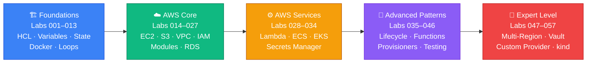

<div class="grid grid-cols-5 gap-2 mt-4 text-center text-sm">

<div class="bg-blue-50 rounded p-2 text-gray-800 border-l-4 border-blue-500">
  <div class="font-bold text-blue-700">Foundations</div>
  <div>001–013</div>
  <div class="text-xs opacity-70">~3 hrs</div>
</div>

<div class="bg-green-50 rounded p-2 text-gray-800 border-l-4 border-green-500">
  <div class="font-bold text-green-700">AWS Core</div>
  <div>014–027</div>
  <div class="text-xs opacity-70">~4 hrs</div>
</div>

<div class="bg-orange-50 rounded p-2 text-gray-800 border-l-4 border-orange-500">
  <div class="font-bold text-orange-700">AWS Services</div>
  <div>028–034</div>
  <div class="text-xs opacity-70">~3 hrs</div>
</div>

<div class="bg-purple-50 rounded p-2 text-gray-800 border-l-4 border-purple-500">
  <div class="font-bold text-purple-700">Advanced</div>
  <div>035–046</div>
  <div class="text-xs opacity-70">~4 hrs</div>
</div>

<div class="bg-red-50 rounded p-2 text-gray-800 border-l-4 border-red-500">
  <div class="font-bold text-red-700">Expert</div>
  <div>047–057</div>
  <div class="text-xs opacity-70">~2 hrs</div>
</div>

</div>

---
transition: slide-left
layout: cover
background: https://images.unsplash.com/photo-1504639725590-34d0984388bd?w=1920
class: text-center
---

# 📅 Terraform Foundations

<div class="pt-6">
  <span class="px-6 py-3 rounded-full bg-blue-500 text-white text-xl font-bold">
    Labs 001 – 016
  </span>
</div>

<div class="grid grid-cols-4 gap-4 pt-8 text-sm">
  <div class="px-3 py-2 rounded bg-white bg-opacity-20 text-white">🔧 Install & First Steps</div>
  <div class="px-3 py-2 rounded bg-white bg-opacity-20 text-white">🎲 Providers & State</div>
  <div class="px-3 py-2 rounded bg-white bg-opacity-20 text-white">🐳 Docker & Language</div>
  <div class="px-3 py-2 rounded bg-white bg-opacity-20 text-white">☁️ First AWS Resources</div>
</div>

<div class="abs-bl m-6 text-left text-sm opacity-80 text-white">
  By: Saravanan Sundaramoorthy | ~4 hours | Local + Docker + AWS
</div>

---
transition: slide-left
layout: default
---

# 🧠 Theory — What is Terraform?

<div class="grid grid-cols-2 gap-6">

<div>

<v-clicks>

<div class="bg-blue-50 rounded-lg p-4 text-gray-800 border-l-4 border-blue-500 mb-3">

**Infrastructure as Code (IaC)** — define infrastructure in `.tf` files, commit to git, version it like application code.

</div>

<div class="bg-green-50 rounded-lg p-4 text-gray-800 border-l-4 border-green-500 mb-3">

**HCL (HashiCorp Configuration Language)** — human-friendly declarative language. You describe *what* you want, not *how* to create it.

</div>

<div class="bg-orange-50 rounded-lg p-4 text-gray-800 border-l-4 border-orange-500 mb-3">

**Providers** — plugins that talk to APIs (AWS, GCP, Docker, GitHub…). Downloaded by `terraform init` from `registry.terraform.io`.

</div>

<div class="bg-purple-50 rounded-lg p-4 text-gray-800 border-l-4 border-purple-500">

**State** — `terraform.tfstate` JSON file: Terraform's memory of what it created. Without it, Terraform can't manage existing resources.

</div>

</v-clicks>

</div>

<div>

```hcl
# Every resource block looks like this:
resource "PROVIDER_TYPE" "MY_NAME" {
  attribute = "value"
}

# Real examples:
resource "local_file" "hello" {
  content  = "Hello World"
  filename = "/tmp/hello.txt"
}

resource "aws_instance" "web" {
  ami           = "ami-0abc123"
  instance_type = "t3.micro"
}
```

<div class="bg-red-50 rounded-lg p-3 text-gray-800 border-l-4 border-red-500 text-sm mt-3">

🔑 **Key symbols in `terraform plan`:**
`+` create · `-` destroy · `~` update in-place · `-/+` replace (destroy + create)

</div>

</div>

</div>

---
transition: slide-up
layout: default
---

# 🔄 Terraform Lifecycle — The Core Loop

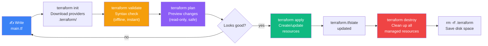

<div class="grid grid-cols-3 gap-4 mt-4 text-sm">

<div class="bg-blue-50 rounded p-3 text-gray-800">
<div class="font-bold text-blue-700 mb-1">📥 init</div>
Downloads provider plugins into <code>.terraform/</code>. Creates <code>.terraform.lock.hcl</code>. Run once per project (or after provider changes).
</div>

<div class="bg-purple-50 rounded p-3 text-gray-800">
<div class="font-bold text-purple-700 mb-1">👁️ plan</div>
Compares desired state (code) vs current state (tfstate + real infra). <strong>Read-only — nothing changes.</strong> Run as many times as you like.
</div>

<div class="bg-green-50 rounded p-3 text-gray-800">
<div class="font-bold text-green-700 mb-1">✅ apply</div>
Executes the plan. Creates/updates/destroys resources. Updates <code>terraform.tfstate</code>. Idempotent — run again, no changes if code matches reality.
</div>

</div>

---
transition: slide-left
layout: default
---

# 📦 Variable Types & tfvars Precedence

<div class="grid grid-cols-2 gap-6">

<div>

### Variable Types

```hcl
variable "name" {
  type    = string      # "hello"
  default = "world"
}

variable "count_val" {
  type    = number      # 42
}

variable "enabled" {
  type    = bool        # true / false
}

variable "servers" {
  type    = list(string) # ["a", "b", "c"]
}

variable "config" {
  type = map(string)    # { key = "value" }
}
```

<div class="bg-blue-50 rounded p-3 text-gray-800 border-l-4 border-blue-500 text-sm mt-2">
Reference variables with <code>var.name</code>. Inside strings: <code>"Hello ${var.name}"</code>
</div>

</div>

<div>

### Precedence Order (lowest → highest)

<v-clicks>

<div class="bg-gray-50 rounded p-3 text-gray-800 text-sm mb-1">1️⃣ <code>default</code> in <code>variable</code> block — fallback</div>
<div class="bg-yellow-50 rounded p-3 text-gray-800 text-sm mb-1">2️⃣ <code>terraform.tfvars</code> — auto-loaded</div>
<div class="bg-orange-50 rounded p-3 text-gray-800 text-sm mb-1">3️⃣ <code>*.auto.tfvars</code> — auto-loaded (alphabetical, last wins)</div>
<div class="bg-blue-50 rounded p-3 text-gray-800 text-sm mb-1">4️⃣ <code>-var-file="env.tfvars"</code> — explicit file (dev/staging/prod)</div>
<div class="bg-purple-50 rounded p-3 text-gray-800 text-sm mb-1">5️⃣ <code>-var='key=value'</code> — CLI override, one-off</div>
<div class="bg-red-50 rounded p-3 text-gray-800 text-sm font-bold">6️⃣ <code>TF_VAR_name</code> — environment variable, HIGHEST</div>

</v-clicks>

<div class="bg-green-50 rounded p-3 text-gray-800 border-l-4 border-green-500 text-sm mt-3">
💡 <strong>CI/CD pattern:</strong> use <code>TF_VAR_*</code> for secrets injected by your pipeline; use <code>-var-file="prod.tfvars"</code> for per-environment config.
</div>

</div>

</div>

---
transition: fade-out
layout: default
---

# 🔧 Group 1 — Install & First Steps (Labs 001–004)

<div class="grid grid-cols-2 gap-6">

<div class="bg-blue-50 rounded-lg p-4 text-gray-800">

### 📁 Lab 001 — First Resource (~15 min)
**Dir:** `~/tf_works/tf_demo`

<v-click>

```hcl
resource "local_file" "demofile" {
  content  = "Hello Folks"
  filename = "/tmp/demofile.txt"
}
```

</v-click>

<v-click>

**What you'll do:**
- Install Terraform binary manually
- Write your first `main.tf`
- Run the full lifecycle: init → plan → apply
- Demonstrate **idempotency** (apply twice = no change)
- Demonstrate **drift detection** (delete file → apply recreates it)
- Run `terraform destroy`; then `rm -rf .terraform`

</v-click>

</div>

<div class="bg-green-50 rounded-lg p-4 text-gray-800">

### 📁 Lab 002 — First Variable (~10 min)
**Dir:** `~/tf_works/002_variables`

<v-click>

```hcl
variable "message" {
  type    = string
  default = "Hello Folks"
}

resource "local_file" "greeting" {
  content  = var.message
  filename = "/tmp/greeting.txt"
}
```

```bash
terraform apply -var='message=Hello from CLI!'
```

</v-click>

<v-click>

**Key lesson:** `-var` overrides the default. Notice `-/+` replace — content changed, so Terraform destroys and recreates the file.

</v-click>

</div>

</div>

---
transition: slide-left
layout: default
---

# 🔧 Labs 003–004 — Variable Types & Precedence

<div class="grid grid-cols-2 gap-6">

<div class="bg-orange-50 rounded-lg p-4 text-gray-800">

### 📁 Lab 003 — Variable Types (~10 min)
**Dir:** `~/tf_works/002_variables`

<v-click>

```hcl
variable "team_members" {
  type    = list(string)
  default = ["Alice", "Bob", "Charlie"]
}

variable "file_config" {
  type = map(string)
  default = {
    greeting = "/tmp/greeting.txt"
    farewell = "/tmp/farewell.txt"
  }
}

resource "local_file" "configs" {
  for_each = var.file_config
  filename = each.value
  content  = "Team: ${join(", ", var.team_members)}"
}
```

</v-click>

<v-click>

**Key lesson:** `for_each` creates one resource per map key. State shows `local_file.configs["greeting"]` — keyed by name, not index.

</v-click>

</div>

<div class="bg-purple-50 rounded-lg p-4 text-gray-800">

### 📁 Lab 004 — tfvars & Precedence (~15 min)
**Dir:** `~/tf_works/002_variables`

<v-click>

```bash
# Step through each layer:
cat > terraform.tfvars << 'EOF'
message = "From terraform.tfvars"
EOF

cat > team.auto.tfvars << 'EOF'
message = "From auto.tfvars"
EOF

terraform apply -var-file="prod.tfvars" \
  -var='message=CLI wins!'

export TF_VAR_message="ENV WINS"
terraform apply  # ENV WINS takes priority
```

</v-click>

<v-click>

**Key lesson:** The "peel-off" test — remove layers one by one to prove which source wins at each level. TF_VAR always wins.

</v-click>

</div>

</div>

---
transition: slide-up
layout: default
---

# 🧠 Theory — Terraform Providers & State

<div class="grid grid-cols-2 gap-6">

<div>

<v-clicks>

<div class="bg-blue-50 rounded-lg p-4 text-gray-800 border-l-4 border-blue-500 mb-3">

**Providers are plugins.** The `hashicorp/random` provider generates random values. The `hashicorp/aws` provider talks to the AWS API. Each provider has its own resources and data sources.

</div>

<div class="bg-green-50 rounded-lg p-4 text-gray-800 border-l-4 border-green-500 mb-3">

**State = source of truth.** `terraform.tfstate` is a JSON file that maps your code to real infrastructure. Terraform reads it on every plan/apply to compute what needs to change.

</div>

<div class="bg-orange-50 rounded-lg p-4 text-gray-800 border-l-4 border-orange-500 mb-3">

**Outputs** expose resource values after apply. They are the primary way modules pass data to each other and how CI/CD pipelines extract IPs, IDs, and URLs.

</div>

<div class="bg-red-50 rounded-lg p-4 text-gray-800 border-l-4 border-red-500">

**Sensitive outputs** hide values in terminal display (`<sensitive>`). Use `terraform output -raw NAME` to retrieve them for scripts. Warning: state file still contains plain text — store it securely.

</div>

</v-clicks>

</div>

<div>

```hcl
# Provider declaration
terraform {
  required_providers {
    random = {
      source  = "hashicorp/random"
      version = "~> 3.0"
    }
  }
}

# Random resource
resource "random_string" "password" {
  length  = 16
  special = true
}

# Output (sensitive)
output "db_password" {
  value     = random_string.password.result
  sensitive = true
}
```

```bash
# After apply:
terraform output db_password
# db_password = <sensitive>

terraform output -raw db_password
# aB3$kL9m!Qx2Fp7z
```

</div>

</div>

---
transition: slide-left
layout: default
---

# 🎲 Group 2 — Providers & State (Labs 005–009)

<div class="grid grid-cols-2 gap-6">

<div class="bg-blue-50 rounded-lg p-4 text-gray-800">

### 📁 Lab 005 — Random + Statefile (~20 min)
**Dir:** `~/tf_random_demo`

<v-click>

```hcl
resource "random_string" "datagen" {
  length = 6
}
resource "random_integer" "rint" {
  min = 10
  max = 100
}
```

```bash
terraform apply    # id=D#u2Im
terraform apply    # same! (idempotent)
# Change length = 10 → forces replacement!
# -/+ resource "random_string" "datagen"
#   ~ length = 6 -> 10 # forces replacement
```

</v-click>

<v-click>

**Key lessons:** `terraform validate` catches syntax errors instantly. State file stores the random value — that's why apply twice gives the same result. `# forces replacement` = destroy + recreate.

</v-click>

</div>

<div class="bg-green-50 rounded-lg p-4 text-gray-800">

### 📁 Lab 006 — Outputs (~15 min)
**Dir:** `~/tf_output_demo`

<v-click>

```hcl
output "myrandstring" {
  description = "A random 10-character string"
  value       = random_string.datagen.result
}

output "all_info" {
  value = {
    string   = random_string.datagen.result
    integer  = random_integer.idnum.result
    combined = "${random_string.datagen.result}-${random_integer.idnum.result}"
  }
}
```

```bash
terraform output             # all outputs
terraform output -raw myrandstring  # no quotes
terraform output -json       # machine-readable
```

</v-click>

<v-click>

**Key lesson:** `terraform output -raw` is the pattern for feeding values into bash scripts and CI/CD pipelines.

</v-click>

</div>

</div>

---
transition: slide-up
layout: default
---

# 🎲 Labs 007–009 — Sensitive, Chaining & Dependency Graph

<div class="grid grid-cols-3 gap-4">

<div class="bg-orange-50 rounded-lg p-4 text-gray-800">

### 📁 Lab 007 — Sensitive + Validation (~10 min)
**Dir:** `~/tf_works/007_sensitive`

<v-click>

```hcl
output "password_hidden" {
  value     = random_string.db_password.result
  sensitive = true
}

variable "environment" {
  type    = string
  default = "dev"
  validation {
    condition = contains(
      ["dev","staging","prod"],
      var.environment
    )
    error_message = "Must be dev, staging, or prod."
  }
}
```

**Validation runs at plan time** — bad input rejected before any API call.

</v-click>

</div>

<div class="bg-purple-50 rounded-lg p-4 text-gray-800">

### 📁 Lab 008 — Random Chaining (~15 min)
**Dir:** `~/tf_works/003_random`

<v-click>

```hcl
resource "random_pet" "server" {
  length = 2
}
resource "random_id" "deploy" {
  byte_length = 4
}
resource "local_file" "config" {
  filename = "/tmp/${random_pet.server.id}-config.txt"
  content  = "Deploy: ${random_id.deploy.hex}"
}
```

**Resource chaining** — reference one resource's attribute inside another. Terraform auto-detects the dependency.

</v-click>

</div>

<div class="bg-red-50 rounded-lg p-4 text-gray-800">

### 📁 Lab 009 — Dependency Graph (~10 min)
**Dir:** `~/tf_works/003_random`

<v-click>

```hcl
# Explicit dependency when no reference exists
resource "random_pet" "backup" {
  depends_on = [local_file.server_config]
}
```

```bash
terraform graph | dot -Tpng > graph.png
```

**Dependency graph (DAG)** — Terraform creates resources in topological order. Independent resources run **in parallel**. `depends_on` forces ordering when there is no attribute reference.

</v-click>

</div>

</div>

---
transition: slide-left
layout: default
---

# 🧠 Theory — Docker Provider & Language Features

<div class="grid grid-cols-2 gap-6">

<div>

<v-clicks>

<div class="bg-blue-50 rounded-lg p-4 text-gray-800 border-l-4 border-blue-500 mb-3">

**Non-AWS providers work the same way.** The Docker provider (`kreuzwerker/docker`) manages containers and images via the Docker daemon socket. Providers are just plugins — the HCL syntax is identical.

</div>

<div class="bg-green-50 rounded-lg p-4 text-gray-800 border-l-4 border-green-500 mb-3">

**String interpolation** — `"${expression}"` embeds any Terraform expression inside a string. Combine variables, resource attributes, function results: `"${var.prefix}_${random_string.rs.id}"`.

</div>

<div class="bg-orange-50 rounded-lg p-4 text-gray-800 border-l-4 border-orange-500 mb-3">

**`count`** — create N identical resources from one block. Resources are indexed: `fleet[0]`, `fleet[1]`, `fleet[2]`. Use `count.index` for differentiation. Danger: removing an item from the middle shifts all indices and causes unnecessary replacements.

</div>

<div class="bg-purple-50 rounded-lg p-4 text-gray-800 border-l-4 border-purple-500">

**`for_each`** — create resources keyed by name from a map or set. Resources are stable: removing `"staging"` only destroys `env_password["staging"]` — `"dev"` and `"prod"` are untouched. **Default to `for_each`.**

</div>

</v-clicks>

</div>

<div>

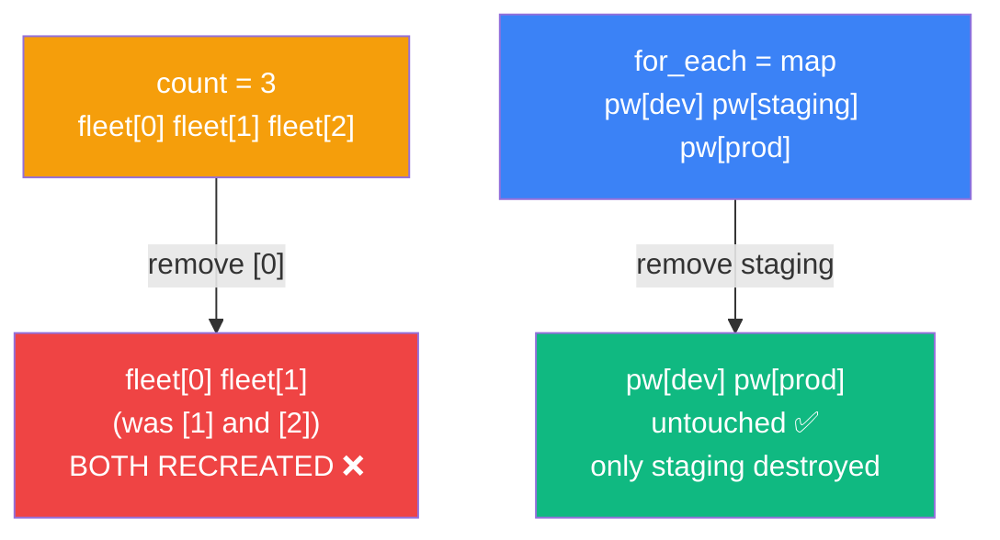

<div class="bg-red-50 rounded p-3 text-gray-800 border-l-4 border-red-500 text-sm mt-3">

⚠️ **count gotcha:** when you delete index `[0]` from a 3-item list, Terraform sees `[1]` renamed to `[0]` and `[2]` renamed to `[1]` — it destroys and recreates both.

</div>

<div class="bg-green-50 rounded p-3 text-gray-800 border-l-4 border-green-500 text-sm mt-2">

✅ **When to use count:** truly identical copies (`count = 3`), conditional creation (`count = var.enabled ? 1 : 0`).

</div>

</div>

</div>

---
transition: slide-left
layout: default
---

# 🐳 Group 3 — Docker & Language Basics (Labs 010–011)

<div class="grid grid-cols-2 gap-6">

<div class="bg-blue-50 rounded-lg p-4 text-gray-800">

### 📁 Lab 010 — Docker Provider (~20 min)
**Dir:** `~/tf_docker_demo`

<v-click>

```hcl
terraform {
  required_providers {
    docker = {
      source  = "kreuzwerker/docker"
      version = "3.0.2"
    }
  }
}

resource "docker_image" "nginx"  { name = "nginx" }
resource "docker_image" "httpd"  { name = "httpd" }

resource "docker_container" "http" {
  name  = "myhttpdapp"
  image = docker_image.httpd.image_id
  ports {
    internal = "80"
    external = "9099"
  }
}
```

```bash
sudo terraform apply --auto-approve
curl localhost:9099   # It works!
```

</v-click>

</div>

<div class="bg-green-50 rounded-lg p-4 text-gray-800">

### 📁 Lab 011 — String Interpolation (~10 min)
**Dir:** `~/tf_random_placeholder`

<v-click>

```hcl
# variables.tf
variable "name_prefix" {
  type = string   # no default → Terraform prompts
}

# main.tf
resource "random_string" "rs" {
  special = false
  length  = var.string_length
}

locals {
  final_name = "${var.name_prefix}_${random_string.rs.id}"
}

# outputs.tf
output "final_name" {
  value = local.final_name
}
```

```bash
terraform apply -var="name_prefix=robochef"
# final_name = "robochef_TKDKdeuWzuJp"
```

</v-click>

</div>

</div>

---
transition: slide-up
layout: default
---

# 🔢 Labs 012–013 — count & for_each

<div class="grid grid-cols-2 gap-6">

<div class="bg-orange-50 rounded-lg p-4 text-gray-800">

### 📁 Lab 012 — count (~10 min)
**Dir:** `~/tf_works/011_count`

<v-click>

```hcl
# Basic count
resource "random_pet" "fleet" {
  count  = 3
  length = 2
}
output "fleet_names" {
  value = random_pet.fleet[*].id
}

# count.index for differentiation
resource "local_file" "numbered" {
  count    = 3
  filename = "/tmp/file-${count.index}.txt"
  content  = "File number ${count.index + 1} of 3"
}

# Conditional creation pattern
resource "random_pet" "backup" {
  count = var.create_backup ? 1 : 0
}
```

</v-click>

<v-click>

**Splat `[*]`** collects an attribute from ALL instances into a list: `random_pet.fleet[*].id → ["light-fox", "bold-ram", "calm-frog"]`

</v-click>

</div>

<div class="bg-purple-50 rounded-lg p-4 text-gray-800">

### 📁 Lab 013 — for_each (~10 min)
**Dir:** `~/tf_works/012_foreach`

<v-click>

```hcl
variable "environments" {
  default = {
    dev     = 12
    staging = 16
    prod    = 24
  }
}

resource "random_string" "env_password" {
  for_each = var.environments
  length   = each.value   # 12, 16, or 24
  special  = true
}

output "env_passwords" {
  sensitive = true
  value = {
    for k, v in random_string.env_password
    : k => v.result
  }
}
```

</v-click>

<v-click>

State uses **keys**: `random_string.env_password["dev"]`. Remove `"staging"` from the map → **only staging destroyed**, dev and prod untouched.

</v-click>

</div>

</div>

---
transition: slide-left
layout: default
---

# 🧠 Theory — First AWS Resources (EC2 & SSH)

<div class="grid grid-cols-2 gap-6">

<div>

<v-clicks>

<div class="bg-blue-50 rounded-lg p-4 text-gray-800 border-l-4 border-blue-500 mb-3">

**AWS provider auth** — configure with `aws configure` (sets `~/.aws/credentials`). The provider reads these automatically. For CI/CD use IAM roles or `TF_VAR_*` / environment variables — never hardcode credentials in HCL.

</div>

<div class="bg-green-50 rounded-lg p-4 text-gray-800 border-l-4 border-green-500 mb-3">

**Data sources** (`data` blocks) read existing infrastructure without managing it. `data "aws_ami"` fetches the latest Ubuntu 22.04 AMI ID dynamically — no more hardcoded `ami-xxxxx` that breaks between regions or expires.

</div>

<div class="bg-orange-50 rounded-lg p-4 text-gray-800 border-l-4 border-orange-500 mb-3">

**`tls_private_key`** — the TLS provider can generate an ED25519 key pair entirely inside Terraform. The private key is stored in state (sensitive). No manual `ssh-keygen` needed. `local_sensitive_file` saves it to disk with `0600` permissions automatically.

</div>

<div class="bg-purple-50 rounded-lg p-4 text-gray-800 border-l-4 border-purple-500">

**Keepers** — a map of values that controls when a random resource is recreated. Same keeper values → same random output (idempotent). Change any keeper → destroy + recreate with a new value. This is the same pattern as AMI ID changes forcing EC2 replacement.

</div>

</v-clicks>

</div>

<div>

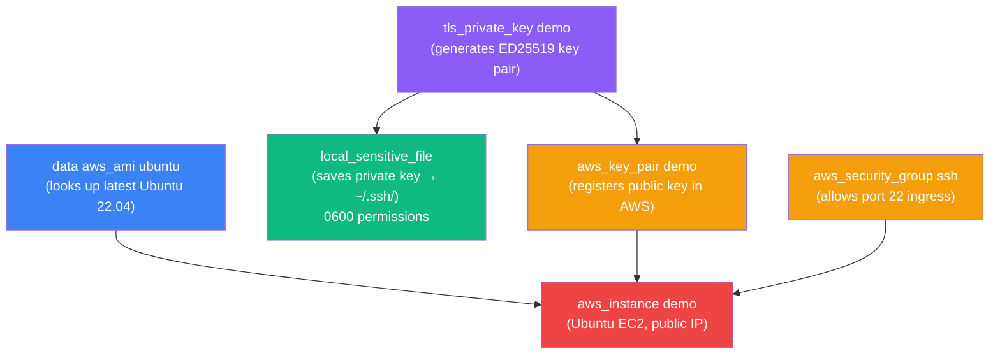

<div class="bg-red-50 rounded p-3 text-gray-800 border-l-4 border-red-500 text-sm mt-2">

⚠️ **AWS labs create billable resources.** Always run `terraform destroy` and then `rm -rf .terraform` after each lab to avoid charges and save disk space.

</div>

</div>

</div>

---
transition: slide-up
layout: default
---

# ☁️ Group 4 — AWS EC2 & SSH Keys (Labs 014–014.1)

<div class="grid grid-cols-2 gap-6">

<div class="bg-blue-50 rounded-lg p-4 text-gray-800">

### 📁 Lab 014 — First EC2 Instance (~20 min)
**Dir:** `~/tf_aws_ec2`

<v-click>

```bash
# Install & configure AWS CLI first
aws configure
# AWS Access Key ID:     YOUR_KEY
# Secret Access Key:     YOUR_SECRET
# Default region:        ap-south-1
# Default output format: json

aws sts get-caller-identity
```

```hcl
provider "aws" { region = var.aws_region }

resource "aws_instance" "demo" {
  ami           = var.ami_id
  instance_type = var.instance_type
  tags = {
    Name      = var.instance_name
    ManagedBy = "terraform"
  }
}
```

</v-click>

<v-click>

**Key lessons:** AMI IDs are region-specific. Tags update **in-place** (`~`) — no replacement needed. EC2 creation takes ~20 seconds (`Still creating... [10s elapsed]`).

</v-click>

</div>

<div class="bg-green-50 rounded-lg p-4 text-gray-800">

### 📁 Lab 014.1 — EC2 + SSH Key + Public IP (~25 min)
**Dir:** `~/terraform-aws-ec2-ssh-demo`

<v-click>

```bash
# Generate SSH key manually
ssh-keygen -t ed25519 -f ~/.ssh/terraform-aws-demo -N ""
chmod 600 ~/.ssh/terraform-aws-demo
```

```hcl
data "aws_ami" "ubuntu" {
  most_recent = true
  owners      = ["099720109477"]  # Canonical
  filter { name="name"
    values=["ubuntu/images/hvm-ssd/ubuntu-jammy-22.04-amd64-server-*"] }
}

resource "aws_key_pair" "demo" {
  key_name   = var.key_name
  public_key = file(pathexpand(var.public_key_path))
}

resource "aws_instance" "demo" {
  ami                         = data.aws_ami.ubuntu.id
  key_name                    = aws_key_pair.demo.key_name
  vpc_security_group_ids      = [aws_security_group.ssh.id]
  associate_public_ip_address = true
}
```

</v-click>

<v-click>

```bash
$(terraform output -raw ssh_command)
# ssh -i ~/.ssh/terraform-aws-demo ubuntu@IP
```

</v-click>

</div>

</div>

---
transition: slide-left
layout: default
---

# ☁️ Labs 015–016 — Keepers & Terraform-Generated SSH Keys

<div class="grid grid-cols-2 gap-6">

<div class="bg-orange-50 rounded-lg p-4 text-gray-800">

### 📁 Lab 015 — Keepers (~10 min)
**Dir:** `~/tf_works/003_random`

<v-click>

```hcl
variable "app_version" {
  type    = string
  default = "1.0.0"
}

resource "random_pet" "app" {
  keepers = {
    version = var.app_version
  }
  length = 2
}

output "app_name" {
  value = "app-${random_pet.app.id}-v${var.app_version}"
}
```

</v-click>

<v-click>

```bash
terraform apply  # app-sunny-cobra-v1.0.0 (same every time)

terraform apply -var='app_version=2.0.0'
# -/+ random_pet.app must be replaced
#   ~ keepers = { "version" = "1.0.0" -> "2.0.0" }  # forces replacement
# app-noble-whale-v2.0.0
```

**AWS analogy:** changing AMI ID = changing a keeper. EC2 replaced. Changing tags = in-place update.

</v-click>

</div>

<div class="bg-purple-50 rounded-lg p-4 text-gray-800">

### 📁 Lab 016 — Terraform-Generated ED25519 Key (~25 min)
**Dir:** `~/terraform-aws-ec2-016-demo`

<v-click>

```hcl
# No ssh-keygen needed!
resource "tls_private_key" "demo" {
  algorithm = "ED25519"
}

resource "local_sensitive_file" "private_key" {
  content         = tls_private_key.demo.private_key_openssh
  filename        = pathexpand(var.private_key_path)
  file_permission = "0600"  # chmod set automatically!
}

resource "aws_key_pair" "demo" {
  key_name   = var.key_name
  public_key = tls_private_key.demo.public_key_openssh
}
```

</v-click>

<v-click>

**Plan: 5 to add** — key, local file, key pair, security group, instance. Private key is `(sensitive value)` throughout. On `terraform destroy`, the private key file is **deleted from disk** automatically.

</v-click>

<v-click>

<div class="bg-red-50 rounded p-2 text-gray-800 border-l-4 border-red-500 text-sm mt-2">
⚠️ Private key lives in <code>terraform.tfstate</code> — treat state as a secret. Never commit it to git.
</div>

</v-click>

</div>

</div>

---
transition: slide-up
layout: default
---

# 📊 Lab Summary — Labs 001–016

<div class="grid grid-cols-2 gap-6">

<div>

### What You Built

<v-clicks>

| Lab | Resource | Provider |
|-----|----------|----------|
| 001 | `local_file` — first resource | `hashicorp/local` |
| 002 | Variables + `-var` override | — |
| 003 | `list` / `map` + `for_each` | — |
| 004 | `tfvars` / `TF_VAR_*` precedence | — |
| 005 | `random_string`, `random_integer` | `hashicorp/random` |
| 006 | `output` blocks + `terraform output` | — |
| 007 | `sensitive`, `validation` block | — |
| 008 | `random_pet`, `random_id`, chaining | — |
| 009 | Dependency graph + `depends_on` | — |
| 010 | `docker_image`, `docker_container` | `kreuzwerker/docker` |
| 011 | `${}` interpolation + `locals` | — |
| 012 | `count` + `count.index` + `[*]` | — |
| 013 | `for_each` + `each.key`/`each.value` | — |
| 014 | First `aws_instance` | `hashicorp/aws` |
| 014.1 | EC2 + SSH key + `data "aws_ami"` | `hashicorp/aws` |
| 015 | `keepers` — controlled recreation | — |
| 016 | `tls_private_key` + `local_sensitive_file` | `hashicorp/tls` |

</v-clicks>

</div>

<div>

### Key Concepts Mastered

<v-clicks>

<div class="bg-blue-50 rounded p-3 text-gray-800 border-l-4 border-blue-500 mb-2 text-sm">
🔄 <strong>Lifecycle:</strong> init → validate → plan → apply → destroy → rm -rf .terraform
</div>

<div class="bg-green-50 rounded p-3 text-gray-800 border-l-4 border-green-500 mb-2 text-sm">
♻️ <strong>Idempotency:</strong> apply twice = no change if code matches reality
</div>

<div class="bg-orange-50 rounded p-3 text-gray-800 border-l-4 border-orange-500 mb-2 text-sm">
🔍 <strong>Drift detection:</strong> delete resource outside Terraform → next apply recreates it
</div>

<div class="bg-purple-50 rounded p-3 text-gray-800 border-l-4 border-purple-500 mb-2 text-sm">
📦 <strong>State:</strong> tfstate = Terraform's memory. Never delete it manually.
</div>

<div class="bg-red-50 rounded p-3 text-gray-800 border-l-4 border-red-500 mb-2 text-sm">
🗝️ <strong>Plan symbols:</strong> + create · - destroy · ~ update · -/+ replace · # forces replacement
</div>

<div class="bg-yellow-50 rounded p-3 text-gray-800 border-l-4 border-yellow-500 text-sm">
🎯 <strong>for_each over count:</strong> key-based = stable on removal. Use count only for N identical copies or conditional creation.
</div>

</v-clicks>

</div>

</div>---
transition: fade
layout: cover
class: text-center
---

# 🏗️ AWS Core Infrastructure

<div class="mt-8 text-6xl font-black bg-gradient-to-r from-orange-400 via-yellow-400 to-green-400 bg-clip-text text-transparent">
  Build. Connect. Secure.
</div>

<div class="mt-6 grid grid-cols-4 gap-4 text-sm">
  <div class="bg-blue-50 text-gray-800 rounded-xl border-2 border-blue-200 p-3">
    🪣 S3 & State Backends<br/><span class="text-xs text-gray-500">Labs 017–019</span>
  </div>
  <div class="bg-green-50 text-gray-800 rounded-xl border-2 border-green-200 p-3">
    🖥️ EC2 & ElastiCache<br/><span class="text-xs text-gray-500">Labs 020–021</span>
  </div>
  <div class="bg-purple-50 text-gray-800 rounded-xl border-2 border-purple-200 p-3">
    🔒 VPC, IAM & Security<br/><span class="text-xs text-gray-500">Labs 022–024</span>
  </div>
  <div class="bg-orange-50 text-gray-800 rounded-xl border-2 border-orange-200 p-3">
    📦 Terraform Modules<br/><span class="text-xs text-gray-500">Labs 025–027</span>
  </div>
</div>

<div class="mt-6 text-gray-400 text-sm">By: Saravanan Sundaramoorthy</div>

---
transition: slide-left
layout: center
class: text-center
---

# 🪣 S3 & Remote State Backends

## Labs 017 – 019

<div class="mt-4 text-2xl text-gray-500">From local state to production-grade remote state with locking 🔐</div>

---
transition: slide-left
---

# 📡 Theory: S3 Buckets & Remote State

<div class="grid grid-cols-2 gap-6">

<div>

## 😰 The Problem with Local State

<v-clicks>

<div class="border-l-4 border-red-500 bg-red-50 text-gray-800 rounded-lg p-3 mb-3">
  ⚠️ <strong>Local <code>terraform.tfstate</code> is risky</strong><br/>
  Team members overwrite each other's changes — silent corruption!
</div>

<div class="border-l-4 border-red-500 bg-red-50 text-gray-800 rounded-lg p-3 mb-3">
  🚫 <strong>No collaboration</strong><br/>
  You can't share state between CI/CD pipelines and developers
</div>

<div class="border-l-4 border-red-500 bg-red-50 text-gray-800 rounded-lg p-3">
  💥 <strong>No locking</strong><br/>
  Two <code>terraform apply</code> at the same time = race condition
</div>

</v-clicks>

</div>

<div>

## ✅ The S3 + DynamoDB Solution

<v-clicks>

<div class="bg-blue-50 text-gray-800 rounded-xl border-2 border-blue-200 p-4 mb-3">

```hcl
terraform {
  backend "s3" {
    bucket         = "my-tfstate-bucket"
    key            = "prod/terraform.tfstate"
    region         = "us-east-1"
    dynamodb_table = "terraform-lock"
    encrypt        = true
  }
}
```

</div>

<div class="border-l-4 border-blue-500 bg-blue-50 text-gray-800 rounded-lg p-3">
  🏆 <strong>Production Standard</strong><br/>
  S3 = durable remote storage &nbsp;|&nbsp; DynamoDB = atomic state locking
</div>

</v-clicks>

</div>

</div>

---
transition: slide-left
---

# 🧪 Lab 017 — S3 Bucket & Object Upload

<div class="border-l-4 border-blue-500 bg-blue-50 text-gray-800 rounded-lg p-3 mb-4">
  📁 Working dir: <code>~/terraform-aws-s3-017-demo/</code>
</div>

<div class="grid grid-cols-2 gap-6">

<div>

## 🎯 What You'll Build

<v-clicks>

- 🪣 An S3 bucket with `aws_s3_bucket`
- 📄 Upload a file using `aws_s3_object`
- 🔗 Output the public object URL with `terraform output`
- 🌍 Access the uploaded file via browser!

</v-clicks>

</div>

<div>

## 📝 Key Resources

<v-clicks>

<div class="bg-blue-50 text-gray-800 rounded-xl border-2 border-blue-200 p-4">

```hcl
resource "aws_s3_bucket" "demo" {
  bucket = "my-demo-bucket-${random_id.suffix.hex}"
}

resource "aws_s3_object" "index" {
  bucket       = aws_s3_bucket.demo.id
  key          = "index.html"
  source       = "index.html"
  content_type = "text/html"
}

output "object_url" {
  value = "https://${aws_s3_bucket.demo.bucket_domain_name}/index.html"
}
```

</div>

</v-clicks>

</div>

</div>

<v-click>

```bash
terraform init && terraform apply -auto-approve
terraform output object_url   # grab the URL 🔗
terraform destroy -auto-approve && rm -rf .terraform
```

</v-click>

---
transition: slide-left
---

# 🧪 Lab 018 — Migrate State to S3 Backend

<div class="border-l-4 border-blue-500 bg-blue-50 text-gray-800 rounded-lg p-3 mb-4">
  📁 Working dir: <code>~/terraform-aws-s3-backend-018-demo/</code>
</div>

<div class="grid grid-cols-2 gap-6">

<div>

## 🔄 Migration Steps

<v-clicks>

1. 🏠 Start with local state (`terraform.tfstate` on disk)
2. ➕ Add `backend "s3"` block to `terraform` config
3. 🚀 Run `terraform init` — Terraform prompts to migrate
4. ✅ Confirm migration — state moves to S3!
5. 🔍 Verify with `aws s3 ls s3://my-bucket/`

</v-clicks>

</div>

<div>

## 📝 Backend Configuration

<v-clicks>

<div class="bg-blue-50 text-gray-800 rounded-xl border-2 border-blue-200 p-4">

```hcl
terraform {
  required_providers {
    aws = { source = "hashicorp/aws" }
  }

  backend "s3" {
    bucket  = "my-tfstate-bucket-018"
    key     = "demo/terraform.tfstate"
    region  = "us-east-1"
    encrypt = true
  }
}
```

</div>

<div class="border-l-4 border-green-500 bg-green-50 text-gray-800 rounded-lg p-3 mt-3">
  💡 <strong>Pro tip:</strong> After migration, your local <code>terraform.tfstate</code> is a stale backup — safe to delete!
</div>

</v-clicks>

</div>

</div>

<v-click>

```bash
terraform init   # "Do you want to copy existing state? yes"
terraform apply -auto-approve
terraform destroy -auto-approve && rm -rf .terraform
```

</v-click>

---
transition: slide-left
---

# 🧪 Lab 019 — DynamoDB State Locking

<div class="border-l-4 border-blue-500 bg-blue-50 text-gray-800 rounded-lg p-3 mb-4">
  📁 Working dir: <code>~/terraform-aws-dynamo-backend-019-demo/</code>
</div>

<div class="grid grid-cols-2 gap-6">

<div>

## 🔐 Why Locking Matters

<v-clicks>

<div class="border-l-4 border-red-500 bg-red-50 text-gray-800 rounded-lg p-3 mb-3">
  😱 <strong>Without locking:</strong><br/>
  Two <code>apply</code> runs simultaneously → state corruption → infra drift
</div>

<div class="border-l-4 border-green-500 bg-green-50 text-gray-800 rounded-lg p-3">
  ✅ <strong>With DynamoDB locking:</strong><br/>
  First apply acquires lock → second apply waits or errors → safe!
</div>

</v-clicks>

</div>

<div>

## 🏗️ DynamoDB Table Setup

<v-clicks>

<div class="bg-blue-50 text-gray-800 rounded-xl border-2 border-blue-200 p-4">

```hcl
resource "aws_dynamodb_table" "tf_lock" {
  name         = "terraform-lock"
  billing_mode = "PAY_PER_REQUEST"
  hash_key     = "LockID"

  attribute {
    name = "LockID"
    type = "S"
  }
}

# Then in backend config:
# dynamodb_table = "terraform-lock"
```

</div>

</v-clicks>

</div>

</div>

<v-click>

```bash
terraform init && terraform apply -auto-approve
# Try running two applies simultaneously — watch the lock! 🔒
terraform destroy -auto-approve && rm -rf .terraform
```

</v-click>

---
transition: slide-left
layout: center
class: text-center
---

# 🖥️ EC2 Advanced & ElastiCache

## Labs 020 – 021

<div class="mt-4 text-2xl text-gray-500">Golden AMIs and managed caching on AWS 🏅</div>

---
transition: slide-left
---

# 📡 Theory: Custom AMIs & ElastiCache

<div class="grid grid-cols-2 gap-6">

<div>

## 🏅 The Golden Image Pattern

<v-clicks>

<div class="border-l-4 border-yellow-500 bg-yellow-50 text-gray-800 rounded-lg p-3 mb-3">
  🌟 <strong>What is a Golden AMI?</strong><br/>
  A pre-baked machine image with all software, config, and patches already installed
</div>

**Why it matters:**

- ⚡ Faster boot — no provisioning at launch time
- 🔒 Consistent — every instance is identical
- 🧪 Tested — bake once, deploy many

</v-clicks>

</div>

<div>

## 🔴 ElastiCache = Managed Redis/Memcached

<v-clicks>

<div class="bg-blue-50 text-gray-800 rounded-xl border-2 border-blue-200 p-4 mb-3">

```
🚀 Golden Image Workflow:
┌─────────────────────────────────┐
│  1. Launch base EC2 instance    │
│  2. SSH in → install software   │
│  3. Create AMI from instance    │
│  4. Launch new EC2 from AMI     │
│  5. Software already present! ✅ │
└─────────────────────────────────┘
```

</div>

<div class="border-l-4 border-red-500 bg-red-50 text-gray-800 rounded-lg p-3">
  🔴 <strong>ElastiCache</strong> = AWS-managed in-memory cache<br/>
  Redis: rich data types, persistence, pub/sub<br/>
  Memcached: pure speed, simple key-value
</div>

</v-clicks>

</div>

</div>

---
transition: slide-left
---

# 🧪 Lab 020 — Custom AMI from EC2 Instance

<div class="border-l-4 border-blue-500 bg-blue-50 text-gray-800 rounded-lg p-3 mb-4">
  📁 Working dir: <code>~/terraform-aws-ami-020-demo/</code>
</div>

<div class="grid grid-cols-2 gap-6">

<div>

## 🔄 Lab Workflow

<v-clicks>

1. 🚀 Launch a base EC2 instance
2. 🔑 SSH in and make changes (install nginx, etc.)
3. 📸 Use `aws_ami_from_instance` to snapshot it
4. 🖥️ Launch a **new** EC2 from your custom AMI
5. ✅ Verify your changes are already there!

</v-clicks>

</div>

<div>

## 📝 Key Resource

<v-clicks>

<div class="bg-blue-50 text-gray-800 rounded-xl border-2 border-blue-200 p-4">

```hcl
resource "aws_ami_from_instance" "golden" {
  name               = "golden-ami-${timestamp()}"
  source_instance_id = aws_instance.base.id

  depends_on = [aws_instance.base]
}

resource "aws_instance" "from_ami" {
  ami           = aws_ami_from_instance.golden.id
  instance_type = "t2.micro"

  tags = {
    Name = "Instance-From-Golden-AMI"
  }
}
```

</div>

</v-clicks>

</div>

</div>

<v-click>

```bash
terraform init && terraform apply -auto-approve
ssh -i key.pem ec2-user@<ip>   # verify nginx is pre-installed ✅
terraform destroy -auto-approve && rm -rf .terraform
```

</v-click>

---
transition: slide-left
---

# 🧪 Lab 021 — ElastiCache Redis Cluster

<div class="border-l-4 border-blue-500 bg-blue-50 text-gray-800 rounded-lg p-3 mb-4">
  📁 Working dir: <code>~/terraform-aws-redis-021-demo/</code>
</div>

<div class="grid grid-cols-2 gap-6">

<div>

## 🎯 What You'll Build

<v-clicks>

- 🔴 Redis ElastiCache cluster
- 🌐 Subnet group spanning multiple AZs
- 🔒 Security group for Redis port (6379)
- 🧪 Test with `redis-cli SET/GET` commands
- 📊 Output the Redis endpoint URL

</v-clicks>

</div>

<div>

## 📝 Key Resources

<v-clicks>

<div class="bg-blue-50 text-gray-800 rounded-xl border-2 border-blue-200 p-4">

```hcl
resource "aws_elasticache_subnet_group" "redis" {
  name       = "redis-subnet-group"
  subnet_ids = [aws_subnet.private.id]
}

resource "aws_elasticache_cluster" "redis" {
  cluster_id           = "my-redis-cluster"
  engine               = "redis"
  node_type            = "cache.t3.micro"
  num_cache_nodes      = 1
  port                 = 6379
  subnet_group_name    = aws_elasticache_subnet_group.redis.name
}
```

</div>

</v-clicks>

</div>

</div>

<v-click>

```bash
terraform apply -auto-approve
redis-cli -h <endpoint> SET greeting "Hello Terraform!" 🔴
redis-cli -h <endpoint> GET greeting
terraform destroy -auto-approve && rm -rf .terraform
```

</v-click>

---
transition: slide-left
layout: center
class: text-center
---

# 🔒 Networking & Security

## Labs 022 – 024

<div class="mt-4 text-2xl text-gray-500">VPCs, bucket policies, and IAM — locking down your AWS infra 🛡️</div>

---
transition: slide-left
---

# 📡 Theory: VPC, IAM & S3 Security

<div class="grid grid-cols-2 gap-6">

<div>

## 🌐 VPC — Your Private Network

<v-clicks>

<div class="bg-blue-50 text-gray-800 rounded-xl border-2 border-blue-200 p-4 mb-3">

```
🏠 VPC (10.0.0.0/16)
├── 🌍 Public Subnet  (10.0.1.0/24)
│   └── Internet Gateway → Route Table
└── 🔒 Private Subnet (10.0.2.0/24)
    └── No direct internet access
```

</div>

- **VPC** = your isolated virtual network
- **Subnets** = IP address ranges within VPC
- **Route tables** = traffic routing rules
- **Internet Gateway** = VPC ↔ internet

</v-clicks>

</div>

<div>

## 🔑 IAM & S3 Security

<v-clicks>

<div class="border-l-4 border-purple-500 bg-purple-50 text-gray-800 rounded-lg p-3 mb-3">
  🔑 <strong>IAM</strong> = Who can do what on which resource<br/>
  Users, Groups, Roles, Policies
</div>

<div class="border-l-4 border-orange-500 bg-orange-50 text-gray-800 rounded-lg p-3 mb-3">
  🪣 <strong>S3 Bucket Policies</strong> = Resource-based policies<br/>
  JSON documents attached directly to the bucket
</div>

<div class="border-l-4 border-green-500 bg-green-50 text-gray-800 rounded-lg p-3">
  🔄 <strong>S3 Versioning + Lifecycle</strong><br/>
  Keep history of objects, auto-archive to Glacier
</div>

</v-clicks>

</div>

</div>

---
transition: slide-left
---

# 🧪 Lab 022 — Custom VPC with Subnets

<div class="border-l-4 border-blue-500 bg-blue-50 text-gray-800 rounded-lg p-3 mb-4">
  📁 Working dir: <code>~/terraform-aws-vpc-022-demo/</code>
</div>

<div class="grid grid-cols-2 gap-6">

<div>

## 🏗️ Network Architecture

<v-clicks>

<div class="bg-blue-50 text-gray-800 rounded-xl border-2 border-blue-200 p-3 mb-3">

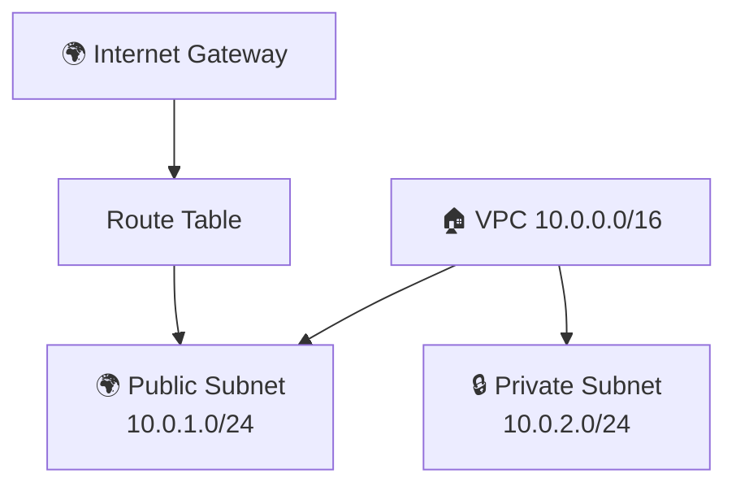

</div>

</v-clicks>

</div>

<div>

## 📝 Key Resources

<v-clicks>

<div class="bg-blue-50 text-gray-800 rounded-xl border-2 border-blue-200 p-4">

```hcl
resource "aws_vpc" "main" {
  cidr_block = "10.0.0.0/16"
  tags = { Name = "main-vpc" }
}

resource "aws_subnet" "public" {
  vpc_id            = aws_vpc.main.id
  cidr_block        = "10.0.1.0/24"
  map_public_ip_on_launch = true
}

resource "aws_internet_gateway" "igw" {
  vpc_id = aws_vpc.main.id
}

resource "aws_route_table" "public" {
  vpc_id = aws_vpc.main.id
  route {
    cidr_block = "0.0.0.0/0"
    gateway_id = aws_internet_gateway.igw.id
  }
}
```

</div>

</v-clicks>

</div>

</div>

<v-click>

```bash
terraform init && terraform apply -auto-approve
terraform destroy -auto-approve && rm -rf .terraform
```

</v-click>

---
transition: slide-left
---

# 🧪 Lab 023 — S3 Bucket Policy, Versioning & Lifecycle

<div class="border-l-4 border-blue-500 bg-blue-50 text-gray-800 rounded-lg p-3 mb-4">
  📁 Working dir: <code>~/terraform-aws-s3-policy-023-demo/</code>
</div>

<div class="grid grid-cols-2 gap-6">

<div>

## 🎯 What You'll Configure

<v-clicks>

- 📜 **Bucket Policy** — JSON resource-based policy
- 🔢 **Versioning** — keep every version of every object
- ♻️ **Lifecycle Rules** — auto-transition old versions to Glacier after 30 days, expire after 90

</v-clicks>

</div>

<div>

## 📝 Bucket Policy & Versioning

<v-clicks>

<div class="bg-blue-50 text-gray-800 rounded-xl border-2 border-blue-200 p-4">

```hcl
resource "aws_s3_bucket_versioning" "demo" {
  bucket = aws_s3_bucket.demo.id
  versioning_configuration {
    status = "Enabled"
  }
}

resource "aws_s3_bucket_policy" "demo" {
  bucket = aws_s3_bucket.demo.id
  policy = jsonencode({
    Version = "2012-10-17"
    Statement = [{
      Effect    = "Allow"
      Principal = { AWS = "arn:aws:iam::ACCOUNT:root" }
      Action    = "s3:GetObject"
      Resource  = "${aws_s3_bucket.demo.arn}/*"
    }]
  })
}
```

</div>

</v-clicks>

</div>

</div>

<v-click>

```bash
terraform apply -auto-approve
# Upload same file twice — see two versions! 🔢
terraform destroy -auto-approve && rm -rf .terraform
```

</v-click>

---
transition: slide-left
---

# 🧪 Lab 024 — IAM Users, Groups, Roles & Policies

<div class="border-l-4 border-blue-500 bg-blue-50 text-gray-800 rounded-lg p-3 mb-4">
  📁 Working dir: <code>~/terraform-aws-iam-024-demo/</code>
</div>

<div class="grid grid-cols-2 gap-6">

<div>

## 🔑 IAM Hierarchy

<v-clicks>

<div class="bg-blue-50 text-gray-800 rounded-xl border-2 border-blue-200 p-4 mb-3">

```
👤 IAM User → belongs to → 👥 Group
                              ↓
                      📋 Managed Policy
                      (AmazonS3ReadOnlyAccess)

🎭 IAM Role ← assumed by EC2 / Lambda
      ↓
📄 Inline Policy (resource-specific perms)
```

</div>

</v-clicks>

</div>

<div>

## 📝 Key Resources

<v-clicks>

<div class="bg-blue-50 text-gray-800 rounded-xl border-2 border-blue-200 p-4">

```hcl
resource "aws_iam_user" "dev" {
  name = "developer-user"
}

resource "aws_iam_group" "devs" {
  name = "developers"
}

resource "aws_iam_group_membership" "devs" {
  name  = "dev-membership"
  users = [aws_iam_user.dev.name]
  group = aws_iam_group.devs.name
}

resource "aws_iam_role" "ec2_role" {
  name               = "ec2-s3-role"
  assume_role_policy = data.aws_iam_policy_document
                         .ec2_assume.json
}
```

</div>

</v-clicks>

</div>

</div>

<v-click>

```bash
terraform apply -auto-approve
aws iam list-users   # see your new IAM user 👤
terraform destroy -auto-approve && rm -rf .terraform
```

</v-click>

---
transition: slide-left
layout: center
class: text-center
---

# 📦 Terraform Modules

## Labs 025 – 027

<div class="mt-4 text-2xl text-gray-500">DRY infrastructure — write once, reuse everywhere ♻️</div>

---
transition: slide-left
---

# 📡 Theory: Reusable Terraform Modules

<div class="grid grid-cols-2 gap-6">

<div>

## 😰 Without Modules (Copy-Paste Hell)

<v-clicks>

<div class="border-l-4 border-red-500 bg-red-50 text-gray-800 rounded-lg p-3 mb-3">

```
project-dev/
  main.tf   # 300 lines of EC2 config
project-staging/
  main.tf   # same 300 lines, slightly different
project-prod/
  main.tf   # same again — drift guaranteed! 😱
```

</div>

<div class="border-l-4 border-red-500 bg-red-50 text-gray-800 rounded-lg p-3">
  ❌ Bug fix? Update in 3 places<br/>
  ❌ Inconsistencies creep in over time<br/>
  ❌ Violates the DRY principle
</div>

</v-clicks>

</div>

<div>

## ✅ With Modules (DRY & Clean)

<v-clicks>

<div class="bg-blue-50 text-gray-800 rounded-xl border-2 border-blue-200 p-4 mb-3">

```hcl
# Calling a module — clean & reusable
module "web_server" {
  source        = "./modules/ec2-instance"

  instance_type = "t2.micro"
  name          = "web-server-prod"
  ami_id        = "ami-0abcdef1234567890"
}

# Use module outputs as inputs elsewhere
output "web_ip" {
  value = module.web_server.public_ip
}
```

</div>

<div class="border-l-4 border-blue-500 bg-blue-50 text-gray-800 rounded-lg p-3">
  📁 Module structure:<br/>
  <code>variables.tf</code> + <code>main.tf</code> + <code>outputs.tf</code>
</div>

</v-clicks>

</div>

</div>

---
transition: slide-left
---

# 🧪 Lab 025 — EC2 Instance Module

<div class="border-l-4 border-blue-500 bg-blue-50 text-gray-800 rounded-lg p-3 mb-4">
  📁 Working dir: <code>~/terraform-modules/ec2-instance/</code>
</div>

<div class="grid grid-cols-2 gap-6">

<div>

## 📁 Module File Structure

<v-clicks>

<div class="bg-blue-50 text-gray-800 rounded-xl border-2 border-blue-200 p-4 mb-3">

```
ec2-instance/
├── variables.tf   # inputs: name, ami, type
├── main.tf        # aws_instance resource
└── outputs.tf     # public_ip, instance_id
```

</div>

<div class="border-l-4 border-green-500 bg-green-50 text-gray-800 rounded-lg p-3">
  💡 A module is just a folder of <code>.tf</code> files — nothing special needed!
</div>

</v-clicks>

</div>

<div>

## 📝 Module Internals

<v-clicks>

<div class="bg-blue-50 text-gray-800 rounded-xl border-2 border-blue-200 p-4">

```hcl
# variables.tf
variable "instance_type" {
  description = "EC2 instance type"
  type        = string
  default     = "t2.micro"
}
variable "name" { type = string }
variable "ami_id" { type = string }

# outputs.tf
output "public_ip" {
  value = aws_instance.this.public_ip
}
output "instance_id" {
  value = aws_instance.this.id
}
```

</div>

</v-clicks>

</div>

</div>

<v-click>

```bash
cd ~/terraform-modules/ec2-instance
terraform init && terraform apply -auto-approve
terraform destroy -auto-approve && rm -rf .terraform
```

</v-click>

---
transition: slide-left
---

# 🧪 Lab 026 — S3 Bucket Module

<div class="border-l-4 border-blue-500 bg-blue-50 text-gray-800 rounded-lg p-3 mb-4">
  📁 Working dir: <code>~/terraform-modules/s3-bucket/</code>
</div>

<div class="grid grid-cols-2 gap-6">

<div>

## 🎯 What the Module Encapsulates

<v-clicks>

- 🪣 `aws_s3_bucket` resource
- 🔢 Optional versioning toggle (variable)
- 🏷️ Consistent tagging via variables
- 📤 Outputs: `bucket_id`, `bucket_arn`, `bucket_domain_name`
- 🔒 Sensible defaults baked in

</v-clicks>

</div>

<div>

## 📝 Module Interface

<v-clicks>

<div class="bg-blue-50 text-gray-800 rounded-xl border-2 border-blue-200 p-4">

```hcl
# variables.tf
variable "bucket_name" {
  description = "Globally unique S3 bucket name"
  type        = string
}

variable "enable_versioning" {
  description = "Enable S3 versioning"
  type        = bool
  default     = false
}

# outputs.tf
output "bucket_arn" {
  value = aws_s3_bucket.this.arn
}

output "bucket_domain_name" {
  value = aws_s3_bucket.this.bucket_domain_name
}
```

</div>

</v-clicks>

</div>

</div>

<v-click>

```bash
cd ~/terraform-modules/s3-bucket
terraform init && terraform apply -auto-approve
terraform destroy -auto-approve && rm -rf .terraform
```

</v-click>

---
transition: slide-left
---

# 🧪 Lab 027 — Root Module Consuming EC2 + S3 Modules

<div class="border-l-4 border-blue-500 bg-blue-50 text-gray-800 rounded-lg p-3 mb-4">
  📁 Working dir: <code>~/terraform-aws-modules-027-demo/</code>
</div>

<div class="grid grid-cols-2 gap-6">

<div>

## 🏗️ Root Module Architecture

<v-clicks>

<div class="bg-blue-50 text-gray-800 rounded-xl border-2 border-blue-200 p-4 mb-3">

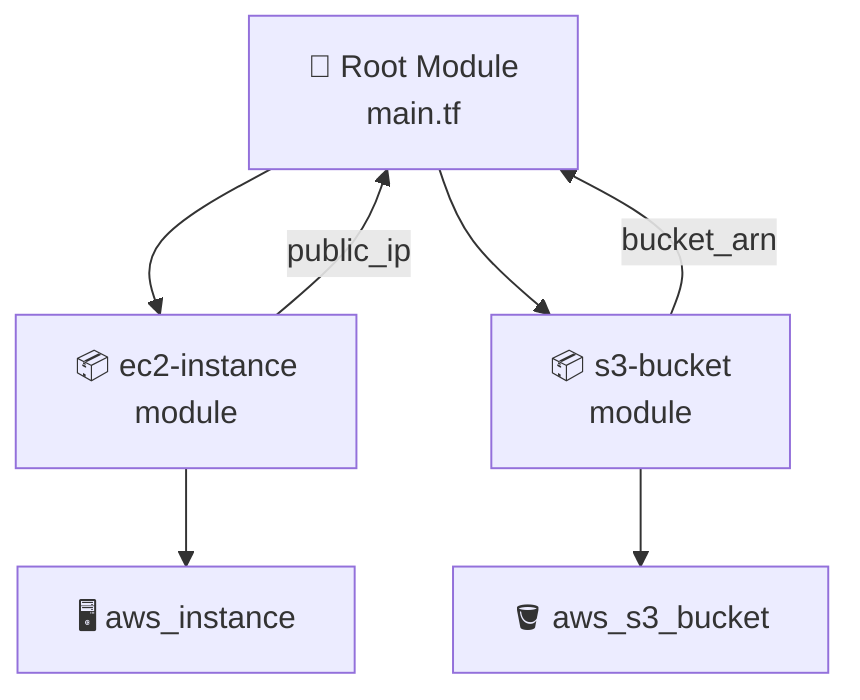

</div>

</v-clicks>

</div>

<div>

## 📝 Root main.tf

<v-clicks>

<div class="bg-blue-50 text-gray-800 rounded-xl border-2 border-blue-200 p-4">

```hcl
module "web_server" {
  source        = "../terraform-modules/ec2-instance"
  name          = "web-server"
  ami_id        = data.aws_ami.amazon_linux.id
  instance_type = "t2.micro"
}

module "assets_bucket" {
  source            = "../terraform-modules/s3-bucket"
  bucket_name       = "my-assets-${random_id.suffix.hex}"
  enable_versioning = true
}

output "server_ip" {
  value = module.web_server.public_ip
}
output "bucket_arn" {
  value = module.assets_bucket.bucket_arn
}
```

</div>

</v-clicks>

</div>

</div>

<v-click>

```bash
terraform init   # downloads both local modules 📦
terraform apply -auto-approve
terraform output   # see combined outputs from both modules! 🎉
terraform destroy -auto-approve && rm -rf .terraform
```

</v-click>

---
transition: slide-left
layout: center
class: text-center
---

# 🎉 AWS Core Complete!

<div class="grid grid-cols-2 gap-6 mt-8 text-left">

<div class="bg-blue-50 text-gray-800 rounded-xl border-2 border-blue-200 p-5">

## ✅ What We Covered

<v-clicks>

- 🪣 **017–019** — S3 buckets, remote state, DynamoDB locking
- 🖥️ **020–021** — Custom AMIs (golden images), ElastiCache Redis
- 🔒 **022–024** — Custom VPCs, S3 policies, IAM users/roles
- 📦 **025–027** — Terraform modules — DRY, reusable infrastructure

</v-clicks>

</div>

<div class="bg-green-50 text-gray-800 rounded-xl border-2 border-green-200 p-5">

## 🚀 Key Takeaways

<v-clicks>

- 🔐 **Always use remote state** — S3 + DynamoDB for teams
- 🏅 **Golden AMIs** — bake once, deploy consistently
- 🌐 **VPC isolation** — never expose private resources directly
- 🔑 **IAM least privilege** — grant only what's needed
- ♻️ **Modules = DRY** — write once, reuse everywhere

</v-clicks>

</div>

</div>

<div class="mt-8 text-gray-400 text-sm">By: Saravanan Sundaramoorthy</div>
---
transition: slide-left
layout: center
class: text-center
---

# 🌅 AWS Services: RDS, Lambda, ECS, EKS & Kubernetes

<div class="bg-blue-50 text-gray-800 rounded-xl border-2 border-blue-300 p-6 mt-6 mx-auto max-w-2xl">

🗓️ Labs **028 – 034** &nbsp;|&nbsp; Managed Databases · Serverless · Containers · Kubernetes

**By: Saravanan Sundaramoorthy**

</div>

---
transition: fade
layout: default
---

# 🗄️ RDS & Lambda — Managed Services

<div class="grid grid-cols-2 gap-6">

<div class="bg-blue-50 text-gray-800 rounded-xl border-2 border-blue-300 p-4">

### 🐘 Amazon RDS

<v-clicks>

- 📦 **Managed relational DB** — no OS patching needed
- 🔁 **Multi-AZ** for high availability & failover
- 💸 `db.t3.micro` — free tier eligible
- 🌏 Postgres **16.14** in `ap-south-1`

</v-clicks>

</div>

<div class="bg-blue-50 text-gray-800 rounded-xl border-2 border-blue-300 p-4">

### ⚡ AWS Lambda

<v-clicks>

- 🎯 **Event-driven** functions — no servers to manage
- 📦 `archive_file` data source **zips** your code automatically
- 🌐 **API Gateway v2** (HTTP API) routes HTTP → Lambda
- 🐍 Python / Node / Go / Java runtimes supported

</v-clicks>

</div>

</div>

<v-click>

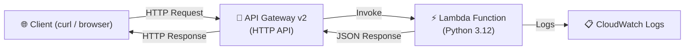

</v-click>

---
transition: slide-up
layout: default
---

# 🧪 Lab 028 — RDS Postgres 16.14

<div class="bg-blue-50 text-gray-800 rounded-xl border-2 border-blue-300 p-5">

**📁 Directory:** `~/terraform-aws-rds-028-demo/`

</div>

<div class="grid grid-cols-2 gap-6 mt-4">

<div class="bg-blue-50 text-gray-800 rounded-xl border-2 border-blue-300 p-4">

### 🏗️ Resources Created

<v-clicks>

- 🐘 `aws_db_instance` — Postgres **16.14**, `db.t3.micro`
- 🔗 `aws_db_subnet_group` — multi-AZ subnet placement
- 🛡️ `aws_security_group` — port **5432** ingress rule
- 🌏 Deployed in **ap-south-1**

</v-clicks>

</div>

<div class="bg-blue-50 text-gray-800 rounded-xl border-2 border-blue-300 p-4">

### 🔬 Verification Steps

<v-clicks>

- `terraform apply` → note the `endpoint` output
- Connect using **psql**:

```bash
psql -h <endpoint> \
     -U dbadmin \
     -d myappdb
```

- Run `\l` to list databases ✅
- `terraform destroy` then `rm -rf .terraform`

</v-clicks>

</div>

</div>

---
transition: slide-up
layout: default
---

# 🧪 Lab 029 — Lambda Python 3.12 + API Gateway v2

<div class="bg-blue-50 text-gray-800 rounded-xl border-2 border-blue-300 p-5">

**📁 Directory:** `~/terraform-aws-lambda-029-demo/`

</div>

<div class="grid grid-cols-2 gap-6 mt-4">

<div class="bg-blue-50 text-gray-800 rounded-xl border-2 border-blue-300 p-4">

### 🏗️ Resources Created

<v-clicks>

- 📦 `data "archive_file"` — zips Python handler automatically
- ⚡ `aws_lambda_function` — Python **3.12** runtime
- 🌐 `aws_apigatewayv2_api` — HTTP API type
- 🔗 `aws_apigatewayv2_integration` — wires API → Lambda
- 🗺️ `aws_apigatewayv2_route` — `GET /hello`
- 🚀 `aws_apigatewayv2_stage` — `$default` auto-deploy

</v-clicks>

</div>

<div class="bg-blue-50 text-gray-800 rounded-xl border-2 border-blue-300 p-4">

### 🔬 Verification Steps

<v-clicks>

- `terraform apply` → note the `invoke_url` output
- Test with **curl**:

```bash
curl $(terraform output -raw invoke_url)/hello
# {"message": "Hello from Lambda! 🎉"}
```

- Check **CloudWatch Logs** for invocation log ✅
- `terraform destroy` then `rm -rf .terraform`

</v-clicks>

</div>

</div>

---
transition: fade
layout: default
---

# 🐳 ECS Fargate + ECR — Serverless Containers

<div class="grid grid-cols-2 gap-6">

<div class="bg-blue-50 text-gray-800 rounded-xl border-2 border-blue-300 p-4">

### 📦 Core Concepts

<v-clicks>

- 🗄️ **ECR** = Elastic Container Registry (private Docker registry on AWS)
- 🚢 **ECS** = Elastic Container Service (run containers without managing servers)
- ⚡ **Fargate** = serverless compute engine for ECS (no EC2 nodes!)
- 📋 **Task Definition** = container config: image, CPU, memory, ports, logs
- 🔄 **Service** = desired count, auto-restart, ALB integration

</v-clicks>

</div>

<div class="bg-blue-50 text-gray-800 rounded-xl border-2 border-blue-300 p-4">

### ⚠️ Key Gotchas

<v-clicks>

- 🔐 `AmazonECSTaskExecutionRolePolicy` only grants `logs:CreateLogStream`
  - Must add **separate IAM policy** for `logs:CreateLogGroup`!
- 🎯 `target_type = "ip"` is **required** for Fargate
  - `"instance"` type will fail — Fargate has no EC2 instance IDs

</v-clicks>

</div>

</div>

<v-click>

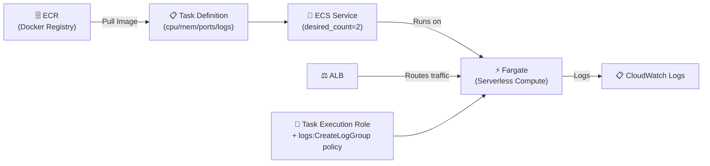

</v-click>

---
transition: slide-up
layout: default
---

# 🧪 Lab 030 — ECS Fargate + ECR + ALB + CloudWatch

<div class="bg-blue-50 text-gray-800 rounded-xl border-2 border-blue-300 p-5">

**📁 Directory:** `~/terraform-aws-ecs-030-demo/`

</div>

<div class="grid grid-cols-2 gap-6 mt-4">

<div class="bg-blue-50 text-gray-800 rounded-xl border-2 border-blue-300 p-4">

### 🏗️ Resources Created

<v-clicks>

- 🗄️ `aws_ecr_repository` — private container registry
- 📋 `aws_ecs_task_definition` — Fargate launch type
- 🚢 `aws_ecs_cluster` + `aws_ecs_service`
- ⚖️ `aws_lb` + `aws_lb_target_group` (`target_type = "ip"`)
- 🔐 IAM execution role with **extra** `logs:CreateLogGroup` policy
- 📊 `aws_cloudwatch_log_group` for container logs

</v-clicks>

</div>

<div class="bg-blue-50 text-gray-800 rounded-xl border-2 border-blue-300 p-4">

### 🔬 Verification Steps

<v-clicks>

- `docker build & push` to ECR
- `terraform apply` → note ALB DNS output
- `curl http://<alb-dns>/` → app response ✅
- Check CloudWatch Logs — container stdout visible
- `terraform destroy` then `rm -rf .terraform`

</v-clicks>

</div>

</div>

---
transition: fade
layout: default
---

# 🔄 Terraform Import & Secrets Manager

<div class="grid grid-cols-2 gap-6">

<div class="bg-blue-50 text-gray-800 rounded-xl border-2 border-blue-300 p-4">

### 📥 `terraform import`

<v-clicks>

- Brings **unmanaged infrastructure** under Terraform control
- ⚠️ Only updates **STATE** — does NOT generate `.tf` config!
- Config must be **written manually** to match real attributes
- Workflow: write config → `terraform import` → `terraform plan` → verify **0 changes**

```bash
terraform import aws_instance.web i-0abc123def456
# Then verify:
terraform plan
# Plan: 0 to add, 0 to change, 0 to destroy ✅
```

</v-clicks>

</div>

<div class="bg-blue-50 text-gray-800 rounded-xl border-2 border-blue-300 p-4">

### 🔐 Secrets Manager

<v-clicks>

- 🔒 **Encrypted secret storage** — at rest and in transit
- 🔁 **Rotation policies** — automatic secret rotation
- ⚡ `recovery_window_in_days = 0` for immediate deletion (labs only!)

```hcl
resource "aws_secretsmanager_secret" "app" {
  name = "my-app-secret"
  recovery_window_in_days = 0
}

resource "aws_secretsmanager_secret_version" "app" {
  secret_id     = aws_secretsmanager_secret.app.id
  secret_string = jsonencode({ password = "s3cr3t" })
}
```

</v-clicks>

</div>

</div>

---
transition: slide-up
layout: default
---

# 🧪 Lab 031 — Terraform Import (EC2)

<div class="bg-blue-50 text-gray-800 rounded-xl border-2 border-blue-300 p-5">

**📁 Directory:** `~/terraform-aws-import-031-demo/`

</div>

<div class="grid grid-cols-2 gap-6 mt-4">

<div class="bg-blue-50 text-gray-800 rounded-xl border-2 border-blue-300 p-4">

### 🏗️ Lab Steps

<v-clicks>

1. 🔧 **AWS CLI** creates an EC2 instance out-of-band:
```bash
aws ec2 run-instances \
  --image-id ami-xxxxxxxx \
  --instance-type t3.micro \
  --tag-specifications \
    'ResourceType=instance,Tags=[{Key=Name,Value=imported-ec2}]'
```
2. ✍️ Write matching `aws_instance` resource in `main.tf`
3. 📥 Run `terraform import aws_instance.web <instance-id>`

</v-clicks>

</div>

<div class="bg-blue-50 text-gray-800 rounded-xl border-2 border-blue-300 p-4">

### 🔬 Verification Steps

<v-clicks>

- `terraform plan` → **0 to add, 0 to change, 0 to destroy** ✅
- This proves the config matches the real state
- `terraform destroy` then `rm -rf .terraform`

```
Plan: 0 to add, 0 to change, 0 to destroy.
```

> 💡 If plan shows changes, adjust `.tf` attributes to match real resource

</v-clicks>

</div>

</div>

---
transition: slide-up
layout: default
---

# 🧪 Lab 032 — Secrets Manager

<div class="bg-blue-50 text-gray-800 rounded-xl border-2 border-blue-300 p-5">

**📁 Directory:** `~/terraform-aws-secrets-032-demo/`

</div>

<div class="grid grid-cols-2 gap-6 mt-4">

<div class="bg-blue-50 text-gray-800 rounded-xl border-2 border-blue-300 p-4">

### 🏗️ Resources Created

<v-clicks>

- 🔐 `aws_secretsmanager_secret` — named secret with `recovery_window_in_days = 0`
- 📝 `aws_secretsmanager_secret_version` — stores JSON key/value pairs
- 📤 Outputs secret ARN for reference

</v-clicks>

</div>

<div class="bg-blue-50 text-gray-800 rounded-xl border-2 border-blue-300 p-4">

### 🔬 Verification Steps

<v-clicks>

- `terraform apply` → secret created in Secrets Manager
- Retrieve secret via AWS CLI:
```bash
aws secretsmanager get-secret-value \
  --secret-id $(terraform output -raw secret_arn) \
  --query SecretString \
  --output text
```
- Verify JSON payload is readable ✅
- `terraform destroy` then `rm -rf .terraform`

</v-clicks>

</div>

</div>

---
transition: fade
layout: default
---

# ☸️ EKS Cluster & Kubernetes Provider

<div class="grid grid-cols-2 gap-6">

<div class="bg-blue-50 text-gray-800 rounded-xl border-2 border-blue-300 p-4">

### 🏗️ Core Concepts

<v-clicks>

- ☸️ **EKS** = managed Kubernetes control plane (AWS manages API server, etcd, scheduler)
- 🔐 **Two IAM roles required:**
  - Cluster role → for EKS control plane
  - Node role → for EC2 worker nodes
- 🖥️ **Node group** = Auto Scaling Group managed by EKS
- ⚠️ Use `t3.small` (training account restricted to free-tier eligible instances — NOT `t3.medium`)

</v-clicks>

</div>

<div class="bg-blue-50 text-gray-800 rounded-xl border-2 border-blue-300 p-4">

### 🔌 Kubernetes Provider

<v-clicks>

- Connects via `host`, `cluster_ca_certificate`, `token`
- Token sourced from `aws_eks_cluster_auth` data source

```hcl
provider "kubernetes" {
  host = aws_eks_cluster.main.endpoint
  cluster_ca_certificate = base64decode(
    aws_eks_cluster.main.certificate_authority[0].data
  )
  token = data.aws_eks_cluster_auth.main.token
}
```

- Resources: `kubernetes_namespace`, `kubernetes_configmap`, `kubernetes_deployment`, `kubernetes_service`

</v-clicks>

</div>

</div>

---
transition: slide-up
layout: default
---

# ☸️ EKS Architecture

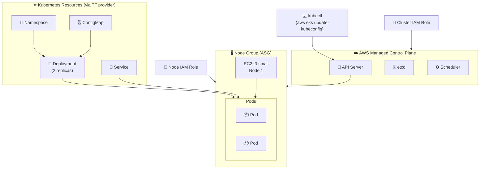

---
transition: slide-up
layout: default
---

# 🧪 Lab 033 — EKS 1.31 Cluster + Node Group

<div class="bg-blue-50 text-gray-800 rounded-xl border-2 border-blue-300 p-5">

**📁 Directory:** `~/terraform-aws-eks-033-demo/`

</div>

<div class="grid grid-cols-2 gap-6 mt-4">

<div class="bg-blue-50 text-gray-800 rounded-xl border-2 border-blue-300 p-4">

### 🏗️ Resources Created

<v-clicks>

- 🔐 IAM role for **EKS cluster** + `AmazonEKSClusterPolicy`
- 🔐 IAM role for **node group** + worker node policies
- ☸️ `aws_eks_cluster` — Kubernetes **1.31**
- 🖥️ `aws_eks_node_group` — **1×t3.small** (free-tier safe)
- 🔒 VPC + subnets + security groups

</v-clicks>

</div>

<div class="bg-blue-50 text-gray-800 rounded-xl border-2 border-blue-300 p-4">

### 🔬 Verification Steps

<v-clicks>

- `terraform apply` (takes ~15 min ⏳)
- Configure kubectl:
```bash
aws eks update-kubeconfig \
  --region ap-south-1 \
  --name $(terraform output -raw cluster_name)
```
- Verify nodes are Ready:
```bash
kubectl get nodes
# NAME              STATUS   ROLES    AGE
# ip-10-0-x.x...   Ready    <none>   2m ✅
```
- `terraform destroy` then `rm -rf .terraform`

</v-clicks>

</div>

</div>

---
transition: slide-up
layout: default
---

# 🧪 Lab 034 — Kubernetes Resources via Terraform Provider

<div class="bg-blue-50 text-gray-800 rounded-xl border-2 border-blue-300 p-5">

**📁 Directory:** `~/terraform-aws-k8s-034-demo/`

</div>

<div class="grid grid-cols-2 gap-6 mt-4">

<div class="bg-blue-50 text-gray-800 rounded-xl border-2 border-blue-300 p-4">

### 🏗️ Resources Created

<v-clicks>

- 📁 `kubernetes_namespace` — isolated namespace
- 🗒️ `kubernetes_configmap` — app configuration as key/value
- 🔄 `kubernetes_deployment` — **2 replicas**, image from ECR
- 🔗 `kubernetes_service` — ClusterIP / LoadBalancer to expose pods
- 🔌 Kubernetes provider using `aws_eks_cluster_auth` token

</v-clicks>

</div>

<div class="bg-blue-50 text-gray-800 rounded-xl border-2 border-blue-300 p-4">

### 🔬 Verification Steps

<v-clicks>

- `terraform apply` → Kubernetes resources created
- Verify with kubectl:
```bash
kubectl get namespace
kubectl get configmap -n myapp
kubectl get deployment -n myapp
# 2/2 replicas READY ✅
kubectl get pods -n myapp
kubectl get service -n myapp
```
- `terraform destroy` then `rm -rf .terraform`

</v-clicks>

</div>

</div>
---
class: text-center flex flex-col items-center justify-center
---

# <span class="text-orange-600">Advanced Terraform: Language, Testing & Integrations</span>

<div class="pt-4">
  <span class="px-6 py-3 rounded-xl bg-gradient-to-r from-orange-500 to-red-500 text-white text-xl font-bold shadow-lg">
    Labs 035 – 046
  </span>
</div>

<div class="grid grid-cols-3 gap-4 pt-8 text-sm">
  <div class="p-3 bg-orange-50 text-gray-800 rounded-xl border-2 border-orange-200 text-center">
    <div class="text-2xl mb-1">🔧</div>
    <strong>null_resource & Workspaces</strong><br/>
    <span class="text-xs opacity-70">Labs 035–036</span>
  </div>
  <div class="p-3 bg-blue-50 text-gray-800 rounded-xl border-2 border-blue-200 text-center">
    <div class="text-2xl mb-1">♻️</div>
    <strong>Lifecycle & Loops</strong><br/>
    <span class="text-xs opacity-70">Labs 037–038</span>
  </div>
  <div class="p-3 bg-purple-50 text-gray-800 rounded-xl border-2 border-purple-200 text-center">
    <div class="text-2xl mb-1">🔀</div>
    <strong>Conditionals & Functions</strong><br/>
    <span class="text-xs opacity-70">Labs 039–041</span>
  </div>
</div>

<div class="grid grid-cols-3 gap-4 pt-4 text-sm">
  <div class="p-3 bg-green-50 text-gray-800 rounded-xl border-2 border-green-200 text-center">
    <div class="text-2xl mb-1">🚀</div>
    <strong>Provisioners & Ansible</strong><br/>
    <span class="text-xs opacity-70">Labs 042–043</span>
  </div>
  <div class="p-3 bg-yellow-50 text-gray-800 rounded-xl border-2 border-yellow-200 text-center">
    <div class="text-2xl mb-1">🔍</div>
    <strong>Debugging & Testing</strong><br/>
    <span class="text-xs opacity-70">Labs 044–045</span>
  </div>
  <div class="p-3 bg-red-50 text-gray-800 rounded-xl border-2 border-red-200 text-center">
    <div class="text-2xl mb-1">🌿</div>
    <strong>Terragrunt DRY</strong><br/>
    <span class="text-xs opacity-70">Lab 046</span>
  </div>
</div>

---
transition: slide-left
layout: default
---

# 🔧 null_resource, terraform_data & Workspaces

<div class="grid grid-cols-2 gap-6">
<div>

### null_resource & terraform_data

<v-clicks>

- **`null_resource`**: runs provisioners without creating real infrastructure — side-effects only
- **`triggers = {}`**: map of values — when any value changes, `null_resource` is destroyed and re-created, re-running provisioners
- `triggers = { always_run = timestamp() }` → fires on every apply
- `triggers = { version = var.app_version }` → fires only when variable changes
- **`terraform_data`** (1.4+): modern replacement — no provider needed, uses `triggers_replace`, adds `input`/`output` state storage

</v-clicks>

<v-click>

<div class="mt-3 p-3 bg-yellow-50 text-gray-800 rounded-lg border-l-4 border-yellow-500 text-sm">
  ⚠️ <strong>Deprecated:</strong> <code>null_resource</code> is deprecated. Prefer <code>terraform_data</code> in new code.
</div>

</v-click>

</div>
<div>

### Workspaces

<v-clicks>

- Separate **state file per workspace** — resources in one workspace are invisible to another
- `terraform.workspace` — built-in interpolation string with current workspace name
- `terraform workspace new/select/list/delete`
- State layout: `default` → `./terraform.tfstate`, others → `terraform.tfstate.d/<name>/`
- **Use case**: dev/staging/prod environments from the same config using `lookup()` for environment-specific values

</v-clicks>

<v-click>

<div class="mt-3 p-3 bg-red-50 text-gray-800 rounded-lg border-l-4 border-red-500 text-sm">
  ❌ <strong>Anti-pattern:</strong> workspaces do not enforce RBAC. Use separate directories + backends for production isolation.
</div>

</v-click>

</div>
</div>

---
transition: slide-up
layout: default
---

# 🧪 Lab 035 — null_resource, Triggers & terraform_data

**Dir:** `~/terraform-null-035/` &nbsp;|&nbsp; ⏱ ~10 min &nbsp;|&nbsp; By: Saravanan Sundaramoorthy

<div class="grid grid-cols-2 gap-6">
<div>

### What you build

<v-clicks>

- **Demo 1** — `null_resource` with `timestamp()` trigger: re-runs local-exec on every apply
- **Demo 2** — `depends_on` ordering: null_resource waits for `local_file` to be created first
- **Demo 3** — version-controlled trigger: only re-runs when `var.app_version` changes
- **Demo 4** — same as Demo 1 rewritten with `terraform_data`

</v-clicks>

</div>
<div>

### Key HCL

```hcl
# Always-run trigger
resource "null_resource" "greet" {
  triggers = { always_run = timestamp() }
  provisioner "local-exec" {
    command = "echo 'Hello at $(date)'"
  }
}

# Modern equivalent (no provider needed)
resource "terraform_data" "greet_modern" {
  triggers_replace = { always_run = timestamp() }
  provisioner "local-exec" {
    command = "echo 'Hello at $(date)'"
  }
}

# Version-controlled trigger
resource "null_resource" "deploy" {
  triggers = { version = var.app_version }
  provisioner "local-exec" {
    command = "echo 'Deploying ${var.app_version}'"
  }
}
```

</div>
</div>

<v-click>

```bash
terraform apply -auto-approve
terraform apply -auto-approve -var="app_version=1.1.0"   # triggers deploy
terraform destroy -auto-approve && rm -rf .terraform
```

</v-click>

---
transition: slide-left
layout: default
---

# 🧪 Lab 036 — Terraform Workspaces

**Dir:** `~/terraform-workspaces-036/` &nbsp;|&nbsp; ⏱ ~10 min &nbsp;|&nbsp; By: Saravanan Sundaramoorthy

<div class="grid grid-cols-2 gap-6">
<div>

### Workspace commands

```bash
terraform workspace list          # list all (asterisk = active)
terraform workspace show          # print current workspace
terraform workspace new dev       # create + switch
terraform workspace select prod   # switch to existing
terraform workspace delete dev    # delete (must have empty state)
```

### State file layout after all four workspaces

```
~/terraform-workspaces-036/
├── terraform.tfstate              # default
└── terraform.tfstate.d/
    ├── dev/terraform.tfstate
    ├── staging/terraform.tfstate
    └── prod/terraform.tfstate
```

</div>
<div>

### Environment-aware config with `lookup()`

```hcl
locals {
  env_config = {
    default = { tier = "dev",     note = "treat as dev" }
    dev     = { tier = "dev",     note = "development" }
    staging = { tier = "staging", note = "pre-prod" }
    prod    = { tier = "prod",    note = "production!" }
  }
  config = lookup(local.env_config,
                  terraform.workspace,
                  local.env_config["default"])
}

resource "local_file" "env_config" {
  filename = "/tmp/robochef-${terraform.workspace}-config.txt"
  content  = "Tier: ${local.config.tier}\nNote: ${local.config.note}"
}
```

<v-click>

<div class="mt-3 p-2 bg-blue-50 text-gray-800 rounded-lg border-l-4 border-blue-500 text-xs">
  Each workspace gets a different random ID and a different output file — proving state isolation.
</div>

</v-click>

</div>
</div>

---
transition: slide-up
layout: default
---

# ♻️ Lifecycle Meta-Arguments & Loops

<div class="grid grid-cols-2 gap-6">
<div>

### Lifecycle meta-arguments

<v-clicks>

- **`create_before_destroy`**: creates replacement before destroying old → zero-downtime swap. Plan shows `+/-` instead of `-/+`
- **`prevent_destroy`**: blocks `terraform destroy` with an error — protects databases, S3 buckets from accidental deletion
- **`ignore_changes`**: Terraform skips reconciliation of listed attributes — useful when external systems modify tags or ASG desired count
- **`replace_triggered_by`** (1.2+): cascade replacement when another resource changes (e.g. re-deploy when cert changes)

</v-clicks>

</div>
<div>

### Loops

<v-clicks>

- **`for_each` on a map**: creates one named resource instance per map entry — stable keys survive additions/removals
- **`for` expression**: transforms a list or map inline: `[for item in list : upper(item) if item != ""]`
- **`dynamic` block**: generates repeated nested blocks (e.g. `ingress` rules) from a variable list — eliminates copy-paste blocks

</v-clicks>

<v-click>

```hcl
dynamic "ingress" {
  for_each = var.ports
  content {
    from_port = ingress.value
    to_port   = ingress.value
    protocol  = "tcp"
  }
}
```

</v-click>

</div>
</div>

---
transition: slide-left
layout: default
---

# 🧪 Lab 037 — Lifecycle Meta-Arguments

**Dir:** `~/tf_works/037_lifecycle/` &nbsp;|&nbsp; ⏱ ~15 min &nbsp;|&nbsp; By: Saravanan Sundaramoorthy

<div class="grid grid-cols-2 gap-6">
<div>

### All four lifecycle settings

```hcl
# create_before_destroy — zero-downtime replacement
resource "random_string" "token" {
  length = 16
  lifecycle {
    create_before_destroy = true
  }
}

# prevent_destroy — protects critical resource
resource "local_file" "db_config" {
  filename = "/tmp/db.conf"
  content  = "host=db.prod"
  lifecycle {
    prevent_destroy = true
  }
}
```

</div>
<div>

```hcl
# ignore_changes — tolerate external drift
resource "local_file" "app_config" {
  filename = "/tmp/app.conf"
  content  = var.app_config
  lifecycle {
    ignore_changes = [content]
  }
}

# replace_triggered_by — cascade replacement
resource "random_string" "cert_id" { length = 8 }

resource "local_file" "server_config" {
  filename = "/tmp/server.conf"
  content  = "cert=${random_string.cert_id.result}"
  lifecycle {
    replace_triggered_by = [random_string.cert_id]
  }
}
```

<v-click>

<div class="mt-2 p-2 bg-orange-50 text-gray-800 rounded-lg border-l-4 border-orange-500 text-xs">
  Plan shows <code>+/-</code> for create_before_destroy vs <code>-/+</code> for normal replacement.
</div>

</v-click>

</div>
</div>

---
transition: slide-up
layout: default
---

# 🧪 Lab 038 — Loops: for_each, for Expressions & Dynamic Blocks

**Dir:** `~/tf_works/038_loops/` &nbsp;|&nbsp; ⏱ ~20 min &nbsp;|&nbsp; By: Saravanan Sundaramoorthy

<div class="grid grid-cols-2 gap-6">
<div>

### for_each on maps

```hcl
variable "environments" {
  default = {
    dev     = { tier = "dev",  size = "small" }
    staging = { tier = "stg",  size = "medium" }
    prod    = { tier = "prod", size = "large" }
  }
}

resource "local_file" "env" {
  for_each = var.environments
  filename = "/tmp/${each.key}-config.txt"
  content  = "tier=${each.value.tier}"
}
```

### for expression (filter)

```hcl
locals {
  prod_only = {
    for k, v in var.environments :
    k => v if v.tier == "prod"
  }
}
```

</div>
<div>

### dynamic block

```hcl
variable "ports" {
  default = [80, 443, 8080]
}

resource "local_file" "firewall" {
  filename = "/tmp/firewall.txt"
  content  = join("\n", [
    for p in var.ports : "ALLOW ${p}/tcp"
  ])
}
```

<v-click>

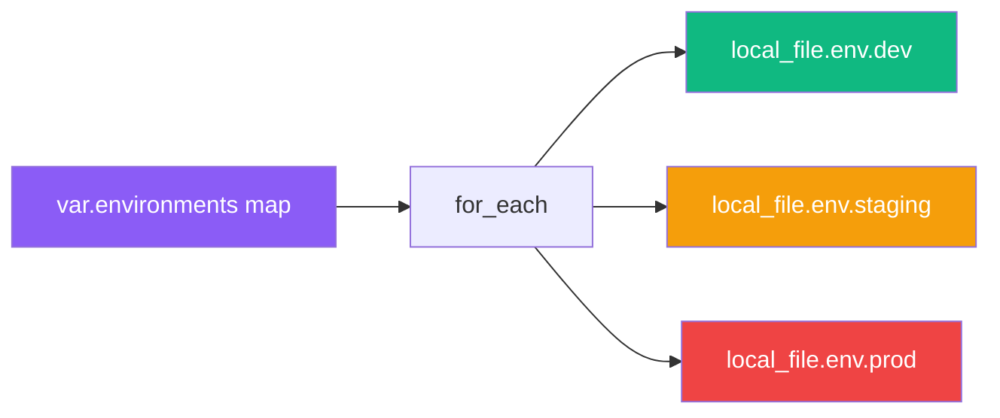

</v-click>

</div>
</div>

---
transition: slide-left
layout: default
---

# 🔀 Conditionals, Functions & Templates

<div class="grid grid-cols-2 gap-6">
<div>

### Conditionals — no `if` keyword in Terraform

<v-clicks>

- **Count conditional** — Terraform's "if": `count = var.enable ? 1 : 0`
- **Ternary in arguments**: `length = var.is_prod ? 32 : 16`
- **Complex if-else** via for_each filter: `for_each = { for k, v in var.features : k => v if v == true }`
- **`templatefile(path, vars)`**: renders a file with `${var}` substitution plus `%{ for }` / `%{ if }` directives — use for nginx configs, cloud-init scripts, JSON/YAML

</v-clicks>

</div>
<div>

### 9 Built-in Function Categories

<v-click>

<div class="p-3 bg-purple-50 text-gray-800 rounded-xl text-sm">

| Category | Examples |
|---|---|
| Numeric | `abs`, `ceil`, `max`, `min` |
| String | `lower`, `format`, `split`, `join` |
| Collection | `length`, `flatten`, `lookup`, `merge` |
| Encoding | `jsonencode`, `base64encode` |
| Filesystem | `file`, `abspath`, `dirname` |
| Date/Time | `timestamp`, `formatdate` |
| Hash/Crypto | `md5`, `sha256`, `bcrypt` |
| IP Network | `cidrsubnet`, `cidrhost` |
| Type Conv. | `tostring`, `tolist`, `tomap` |

</div>

</v-click>

</div>
</div>

---
transition: slide-up
layout: default
---

# 🧪 Lab 039 — Conditionals & If Statements

**Dir:** `~/tf_works/039_conditionals/` &nbsp;|&nbsp; ⏱ ~15 min &nbsp;|&nbsp; By: Saravanan Sundaramoorthy

<div class="grid grid-cols-2 gap-6">
<div>

### count = 0 or 1 (the Terraform "if")

```hcl
variable "enable_debug" { default = false }
variable "environment"  { default = "dev" }

# Resource only exists when enable_debug is true
resource "local_file" "debug_log" {
  count    = var.enable_debug ? 1 : 0
  filename = "/tmp/debug.log"
  content  = "Debug mode enabled"
}
```

### Ternary in arguments

```hcl
resource "random_string" "token" {
  length = var.environment == "prod" ? 32 : 16
}
```

</div>
<div>

### for_each filter (if-else equivalent)

```hcl
variable "features" {
  default = {
    logging   = true
    metrics   = true
    debug_api = false
    tracing   = true
  }
}

resource "local_file" "feature" {
  for_each = {
    for k, v in var.features : k => v if v == true
  }
  filename = "/tmp/feature-${each.key}.txt"
  content  = "Feature ${each.key} is enabled"
}
```

<v-click>

<div class="mt-2 p-2 bg-green-50 text-gray-800 rounded-lg border-l-4 border-green-500 text-xs">
  Only <code>logging</code>, <code>metrics</code>, <code>tracing</code> files are created — <code>debug_api</code> is filtered out.
</div>

</v-click>

</div>
</div>

---
transition: slide-left
layout: default
---

# 🧪 Lab 040 — Functions Complete Reference

**Dir:** `~/tf_works/040_functions/` &nbsp;|&nbsp; ⏱ ~20 min &nbsp;|&nbsp; By: Saravanan Sundaramoorthy

<div class="grid grid-cols-2 gap-6">
<div>

### terraform console — interactive REPL

```bash
cd ~/tf_works/040_functions
terraform init
terraform console
```

```hcl
# Try these in the console:
> upper("robochef")
"ROBOCHEF"
> length(["a","b","c"])
3
> cidrsubnet("10.0.0.0/16", 8, 2)
"10.0.2.0/24"
> jsonencode({ env = "prod", port = 443 })
"{\"env\":\"prod\",\"port\":443}"
> formatdate("DD MMM YYYY", timestamp())
"21 May 2026"
> md5("hello")
"5d41402abc4b2a76b9719d911017c592"
```

</div>
<div>

### Functions in actual HCL

```hcl
locals {
  # String functions
  site_upper = upper("robochef.co")
  slug       = replace("My Site Name", " ", "-")

  # Collection functions
  subnets = [
    for i in range(3) : cidrsubnet("10.0.0.0/16", 8, i)
  ]
  # → ["10.0.0.0/24", "10.0.1.0/24", "10.0.2.0/24"]

  # Merge maps
  base_tags = { Owner = "saravanans" }
  env_tags  = { Env = "prod" }
  all_tags  = merge(local.base_tags, local.env_tags)
}
```

<v-click>

<div class="mt-2 p-2 bg-blue-50 text-gray-800 rounded-lg border-l-4 border-blue-500 text-xs">
  💡 You cannot define custom functions in Terraform — only use the 100+ built-ins.
</div>

</v-click>

</div>
</div>

---
transition: slide-up
layout: default
---

# 🧪 Lab 041 — templatefile() Function

**Dir:** `~/terraform-templatefile-041-demo/` &nbsp;|&nbsp; ⏱ ~10 min &nbsp;|&nbsp; By: Saravanan Sundaramoorthy

<div class="grid grid-cols-2 gap-6">
<div>

### Template file: `nginx.conf.tpl`

```nginx
server {
    listen ${port};
    server_name ${domain};

%{ if enable_ssl ~}
    ssl_certificate /etc/ssl/${domain}.crt;
    ssl_certificate_key /etc/ssl/${domain}.key;
%{ endif ~}

    location / {
        proxy_pass http://localhost:${app_port};
    }

%{ for upstream in upstreams ~}
    upstream backend_${upstream.name} {
        server ${upstream.host}:${upstream.port};
    }
%{ endfor ~}
}
```

</div>
<div>

### Terraform calling templatefile()

```hcl
variable "domain"     { default = "robochef.co" }
variable "enable_ssl" { default = true }

resource "local_file" "nginx_config" {
  filename = "/tmp/nginx.conf"
  content  = templatefile("${path.module}/nginx.conf.tpl", {
    port       = 443
    domain     = var.domain
    enable_ssl = var.enable_ssl
    app_port   = 3000
    upstreams  = [
      { name = "api",    host = "10.0.1.5", port = 8080 },
      { name = "static", host = "10.0.1.6", port = 9090 },
    ]
  })
}
```

<v-click>

<div class="mt-2 p-2 bg-purple-50 text-gray-800 rounded-lg border-l-4 border-purple-500 text-xs">
  <code>file()</code> just reads. <code>templatefile()</code> reads + substitutes <code>${var}</code> + evaluates <code>%{ for }</code> / <code>%{ if }</code>.
</div>

</v-click>

</div>
</div>

---
transition: slide-left
layout: default
---

# 🚀 Provisioners — When to Use & Avoid

<div class="grid grid-cols-2 gap-6">
<div>

### Three built-in provisioners

<v-clicks>

- **`file`**: copies a local file to a remote machine via SSH/WinRM
- **`local-exec`**: runs a command on the machine running Terraform (not the remote)
- **`remote-exec`**: runs commands on the remote resource via SSH

</v-clicks>

<v-click>

```hcl
resource "aws_instance" "web" {
  # ...
  provisioner "local-exec" {
    command = "echo ${self.public_ip} > /tmp/ip.txt"
  }
  provisioner "local-exec" {
    when    = destroy          # runs on destroy
    command = "rm /tmp/ip.txt"
  }
  provisioner "remote-exec" {
    on_failure = continue      # don't fail if script errors
    inline = ["sudo apt-get install -y nginx"]
  }
}
```

</v-click>

</div>
<div>

### Decision guide

<v-click>

<div class="p-3 bg-red-50 text-gray-800 rounded-xl text-sm">

| Approach | When to use |
|---|---|
| `user_data` / cloud-init | First-boot package installs |
| Packer (baked AMI) | Golden image pipeline |
| Ansible via local-exec | Full configuration management |
| `remote-exec` | Simple one-shot commands |
| `local-exec` | Calling external tools |

</div>

</v-click>

<v-click>

<div class="mt-3 p-3 bg-orange-50 text-gray-800 rounded-lg border-l-4 border-orange-500 text-sm">
  ⚠️ <strong>Provisioners are a last resort.</strong> They run only at creation time, have no drift detection, can fail silently, and create hidden dependencies.
</div>

</v-click>

</div>
</div>

---
transition: slide-up
layout: default
---

# 🧪 Lab 042 — Provisioners: file, remote-exec, local-exec

**Dir:** `~/terraform-provisioners-042-demo/` &nbsp;|&nbsp; ⏱ ~20 min &nbsp;|&nbsp; By: Saravanan Sundaramoorthy

<div class="grid grid-cols-2 gap-6">
<div>

### file provisioner

```hcl
resource "aws_instance" "web" {
  ami           = var.ami_id
  instance_type = "t3.micro"
  key_name      = aws_key_pair.demo.key_name

  connection {
    type        = "ssh"
    user        = "ubuntu"
    private_key = file(var.private_key_path)
    host        = self.public_ip
  }

  # Copy local nginx config to remote
  provisioner "file" {
    source      = "${path.module}/nginx.conf"
    destination = "/tmp/nginx.conf"
  }
```

</div>
<div>

```hcl
  # Run commands on remote after file copy
  provisioner "remote-exec" {
    inline = [
      "sudo apt-get update -y",
      "sudo apt-get install -y nginx",
      "sudo cp /tmp/nginx.conf /etc/nginx/nginx.conf",
      "sudo systemctl restart nginx",
    ]
  }

  # Run locally after EC2 is up
  provisioner "local-exec" {
    command = <<-EOT
      echo "EC2 is at ${self.public_ip}"
      echo "${self.public_ip}" >> /tmp/deployed-ips.txt
    EOT
  }
}
```

<v-click>

<div class="mt-2 p-2 bg-blue-50 text-gray-800 rounded-lg border-l-4 border-blue-500 text-xs">
  Order matters: <code>file</code> runs first, then <code>remote-exec</code>, then <code>local-exec</code>.
</div>

</v-click>

</div>
</div>

---
transition: slide-left
layout: default
---

# 🧪 Lab 043 — Terraform + Ansible Integration

**Dir:** `~/terraform-aws-ansible-043-demo/` &nbsp;|&nbsp; ⏱ ~25 min &nbsp;|&nbsp; By: Saravanan Sundaramoorthy

<div class="grid grid-cols-2 gap-6">
<div>

### The integration pattern

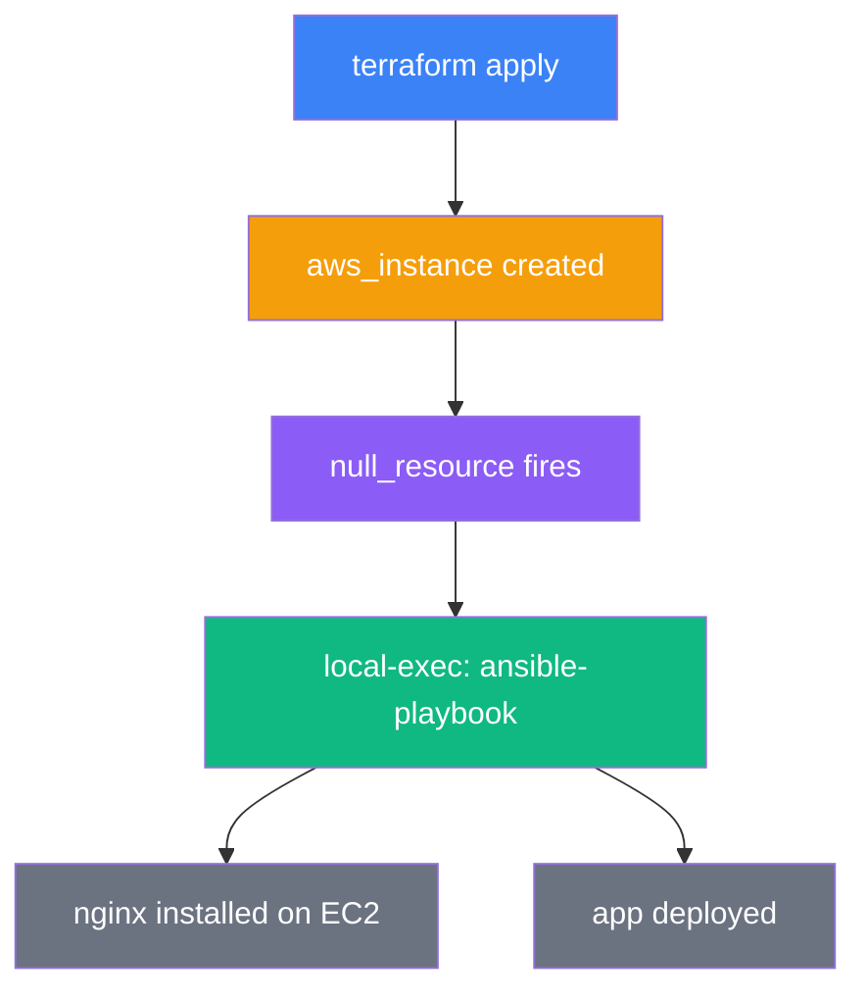

</div>
<div>

### Terraform calls ansible-playbook

```hcl
resource "aws_instance" "web" {
  ami           = var.ami_id
  instance_type = "t3.micro"
  key_name      = aws_key_pair.deploy.key_name
  tags          = { Name = "robochef-ansible-demo" }
}

# Wait for SSH, then run Ansible
resource "null_resource" "configure" {
  depends_on = [aws_instance.web]

  triggers = { instance_id = aws_instance.web.id }

  provisioner "local-exec" {
    command = <<-EOT
      ansible-playbook \
        -i "${aws_instance.web.public_ip}," \
        -u ubuntu \
        --private-key ${var.private_key_path} \
        --ssh-extra-args="-o StrictHostKeyChecking=no" \
        playbooks/install_nginx.yml
    EOT
  }
}
```

</div>
</div>

<v-click>

<div class="p-2 bg-green-50 text-gray-800 rounded-lg border-l-4 border-green-500 text-sm">
  Terraform handles <strong>what exists</strong>. Ansible handles <strong>what runs on it</strong>. Neither needs to know the other's internals.
</div>

</v-click>

---
transition: slide-up
layout: default
---

# 🔍 Debugging & Testing Terraform

<div class="grid grid-cols-2 gap-6">
<div>

### TF_LOG levels

<v-clicks>

- `TRACE` — every API call, every internal step (very verbose)
- `DEBUG` — provider plugin negotiation, request/response bodies
- `INFO` — informational messages
- `WARN` — something may be wrong
- `ERROR` — errors only

</v-clicks>

<v-click>

```bash
export TF_LOG=DEBUG
export TF_LOG_PATH=./terraform.log
terraform plan
```

</v-click>

### Plan symbols

<v-click>

| Symbol | Meaning |
|---|---|
| `+` | add (create) |
| `-` | destroy |
| `~` | update in-place |
| `-/+` | destroy then create |
| `+/-` | create then destroy |
| `<=` | data source read |

</v-click>

</div>
<div>

### Testing pyramid

<v-click>

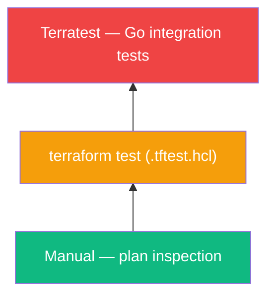

</v-click>

<v-click>

- **`terraform console`**: interactive REPL — evaluate expressions without applying
- **`terraform test`** (1.6+): runs plan or apply against a module, asserts output values in `.tftest.hcl`
- **Terratest**: Go library — `terraform.InitAndApply()`, `terraform.Output()`, `assert.Equal()`

</v-click>

</div>
</div>

---
transition: slide-left
layout: default
---

# 🧪 Lab 044 — Debugging: TF_LOG, Plan Analysis & Console

**Dir:** `/tmp/tf-debug-lab/` &nbsp;|&nbsp; ⏱ ~15 min &nbsp;|&nbsp; By: Saravanan Sundaramoorthy

<div class="grid grid-cols-2 gap-6">
<div>

### Enable and capture logs

```bash
mkdir -p /tmp/tf-debug-lab
cd /tmp/tf-debug-lab

export TF_LOG=DEBUG
export TF_LOG_PATH=./terraform.log

terraform init
terraform plan

# Inspect the log
grep -i "error\|warn" terraform.log | head -20

# Reset logging
unset TF_LOG
unset TF_LOG_PATH
```

### Analyse a plan as JSON

```bash
terraform plan -out=plan.tfplan
terraform show -json plan.tfplan | jq '.resource_changes[].change'
```

</div>
<div>

### terraform console

```bash
terraform console
```

```hcl
# Evaluate expressions interactively
> cidrsubnet("10.0.0.0/16", 8, 3)
"10.0.3.0/24"

> formatdate("DD/MM/YYYY", timestamp())
"21/05/2026"

> length(["a","b","c"])
3

> merge({a=1}, {b=2})
{ "a" = 1, "b" = 2 }
```

<v-click>

<div class="mt-2 p-2 bg-yellow-50 text-gray-800 rounded-lg border-l-4 border-yellow-500 text-xs">
  Use <code>terraform console</code> to test functions and expressions before embedding them in <code>.tf</code> files — instant feedback loop.
</div>

</v-click>

</div>
</div>

---
transition: slide-up
layout: default
---

# 🧪 Lab 045 — Testing: terraform test & Terratest

**Dirs:** `/tmp/tf-test-lab/` & `/tmp/tf-terratest-lab/` &nbsp;|&nbsp; ⏱ ~20 min &nbsp;|&nbsp; By: Saravanan Sundaramoorthy

<div class="grid grid-cols-2 gap-6">
<div>

### terraform test (.tftest.hcl) — 1.6+

```hcl
# /tmp/tf-test-lab/tests/outputs.tftest.hcl

run "verify_file_created" {
  command = apply

  assert {
    condition     = output.file_path == "/tmp/test-output.txt"
    error_message = "File path does not match expected value"
  }

  assert {
    condition     = length(output.content) > 0
    error_message = "Content should not be empty"
  }
}

run "verify_with_prod_vars" {
  command = plan
  variables {
    environment = "prod"
  }
  assert {
    condition     = output.token_length == 32
    error_message = "Prod token should be 32 chars"
  }
}
```

```bash
terraform test
```

</div>
<div>

### Terratest (Go)

```go
// /tmp/tf-terratest-lab/test/main_test.go
package test

import (
    "testing"
    "github.com/gruntwork-io/terratest/modules/terraform"
    "github.com/stretchr/testify/assert"
)

func TestTerraformOutputs(t *testing.T) {
    opts := &terraform.Options{
        TerraformDir: "../",
        Vars: map[string]interface{}{
            "environment": "dev",
        },
    }
    defer terraform.Destroy(t, opts)
    terraform.InitAndApply(t, opts)

    filePath := terraform.Output(t, opts, "file_path")
    assert.Equal(t, "/tmp/dev-output.txt", filePath)
}
```

```bash
go test -v -timeout 10m ./test/
```

</div>
</div>

---
transition: slide-left
layout: default
---

# 🌿 Terragrunt — DRY Terraform

<div class="grid grid-cols-2 gap-6">
<div>

### The problem: copy-paste hell

<v-click>

```
environments/
├── dev/
│   ├── backend.tf      ← identical
│   ├── providers.tf    ← identical
│   └── main.tf
├── staging/
│   ├── backend.tf      ← copy
│   ├── providers.tf    ← copy
│   └── main.tf
└── prod/
    ├── backend.tf      ← copy
    ├── providers.tf    ← copy
    └── main.tf
```

Every backend/provider change → update 3+ files. With 10 modules × 3 envs = 30 copies.

</v-click>

</div>
<div>

### Terragrunt solution

<v-clicks>

- **Thin wrapper** that generates backend/provider config from a parent `terragrunt.hcl`
- **`find_in_parent_folders()`**: walks up the directory tree to locate root `terragrunt.hcl`
- **`run-all`**: apply/destroy the entire environment tree at once with dependency ordering
- **`dependency` blocks**: read outputs from other Terragrunt modules (e.g. VPC ID into subnet module)
- **One source of truth** for backend config, provider version, common tags

</v-clicks>

<v-click>

<div class="mt-3 p-2 bg-green-50 text-gray-800 rounded-lg border-l-4 border-green-500 text-xs">
  Terragrunt keeps your Terraform DRY the same way modules keep your resources DRY.
</div>

</v-click>

</div>
</div>

---
transition: slide-up
layout: default
---

# 🧪 Lab 046 — Terragrunt Root + Child Config

**Dir:** `/tmp/tg-lab/` &nbsp;|&nbsp; ⏱ ~20 min &nbsp;|&nbsp; By: Saravanan Sundaramoorthy

<div class="grid grid-cols-2 gap-6">
<div>

### Root terragrunt.hcl

```hcl
# /tmp/tg-lab/terragrunt.hcl

locals {
  env = path_relative_to_include()
}

# Backend config generated once — inherited by all children
remote_state {
  backend = "local"
  generate = {
    path      = "backend.tf"
    if_exists = "overwrite"
  }
  config = {
    path = "${get_repo_root()}/tfstate/${local.env}/terraform.tfstate"
  }
}

# Common inputs passed to all child modules
inputs = {
  owner   = "saravanans"
  project = "robochef"
}
```

</div>
<div>

### Child terragrunt.hcl

```hcl
# /tmp/tg-lab/dev/terragrunt.hcl

include "root" {
  path = find_in_parent_folders()  # walks up to root
}

terraform {
  source = "..//modules/app"
}

inputs = {
  environment = "dev"
  instance_count = 1
}
```

### dependency block

```hcl
dependency "vpc" {
  config_path = "../vpc"
}

inputs = {
  vpc_id = dependency.vpc.outputs.vpc_id
}
```

### run-all

```bash
cd /tmp/tg-lab
terragrunt run-all apply    # apply all modules in order
terragrunt run-all destroy  # tear down entire environment
```

</div>
</div>
---
transition: slide-left
layout: section
class: text-gray-800
---

# 🌏 Multi-Region & Zero-Downtime
## Labs 047–048

<div class="text-gray-500 mt-4 text-xl">Provider Aliasing · create_before_destroy · No-Gap Deployments</div>

---
transition: fade
layout: default
class: text-gray-800
---

# Theory: Provider Aliasing & Zero-Downtime Deployments

<div class="grid grid-cols-2 gap-6 mt-4">

<div class="bg-blue-50 rounded-xl p-5 border border-blue-200">

### 🔀 Provider Aliases

<v-clicks>

- Declare **multiple instances** of the same provider in one config
- Each alias targets a different region or account
- Resources reference the alias via `provider = aws.<alias>`

</v-clicks>

```hcl
provider "aws" {
  region = "ap-south-1"       # default (Mumbai)
}

provider "aws" {
  alias  = "singapore"
  region = "ap-southeast-1"
}

resource "aws_s3_bucket" "sg" {
  provider = aws.singapore
  bucket   = "my-sg-bucket"
}
```

</div>

<div class="bg-green-50 rounded-xl p-5 border border-green-200">

### ♻️ create_before_destroy

<v-clicks>

- Default destroy order: **destroy old → create new** (`-/+`)
- `create_before_destroy = true` flips it: **create new → destroy old** (`+/-`)
- Ensures **zero gap in service** during replacement
- Critical for: API keys, TLS certs, random tokens, load-balanced targets

</v-clicks>

```hcl
lifecycle {
  create_before_destroy = true
}
```

<div class="bg-yellow-50 rounded p-3 mt-3 text-sm border border-yellow-200">
<strong>Plan output:</strong><br/>
<code>+/- resource "random_string" "token"</code><br/>
new resource created before old is destroyed
</div>

</div>
</div>

---
transition: slide-up
layout: default
class: text-gray-800
---

# Lab 047 — Provider Aliasing: Mumbai + Singapore S3 Buckets

<div class="grid grid-cols-2 gap-6 mt-4">

<div>

<v-clicks>

**Goal:** Deploy paired S3 buckets in two AWS regions using a single Terraform config with provider aliases.

**Directory:** `~/terraform-labs/047-provider-aliasing/`

**Key files:**
- `providers.tf` — default (Mumbai) + aliased (Singapore) providers
- `main.tf` — two `aws_s3_bucket` resources, one per provider
- `outputs.tf` — both bucket ARNs

</v-clicks>

```hcl
# providers.tf
provider "aws" {
  region = "ap-south-1"
}
provider "aws" {
  alias  = "singapore"
  region = "ap-southeast-1"
}
```

</div>

<div>

```hcl
# main.tf
resource "aws_s3_bucket" "mumbai" {
  bucket = "lab047-mumbai-${random_id.suffix.hex}"
}

resource "aws_s3_bucket" "singapore" {
  provider = aws.singapore
  bucket   = "lab047-singapore-${random_id.suffix.hex}"
}
```

<v-clicks>

**Steps:**
1. `terraform init`
2. `terraform plan` — verify 2 buckets in 2 regions
3. `terraform apply`
4. AWS console → check both regions
5. `terraform destroy`
6. `rm -rf .terraform`

</v-clicks>

</div>
</div>

---
transition: slide-up
layout: default
class: text-gray-800
---

# Lab 048 — Zero-Downtime: create_before_destroy with random_string

<div class="grid grid-cols-2 gap-6 mt-4">

<div>

<v-clicks>

**Goal:** Observe the difference between default destroy (`-/+`) and `create_before_destroy` (`+/-`) in Terraform plan output.

**Directory:** `~/terraform-labs/048-zero-downtime/`

**Key concept:** Trigger a replacement by changing `length` of `random_string`, then compare lifecycle behaviour.

</v-clicks>

```hcl
resource "random_string" "token" {
  length  = 16
  special = false

  lifecycle {
    create_before_destroy = true
  }
}
```

</div>

<div>

```bash
# Step 1 — initial apply
terraform apply

# Step 2 — trigger replacement
# change length = 16 → 32
terraform plan

# Without lifecycle — plan shows:
#   -/+  destroy then create

# With lifecycle — plan shows:
#   +/-  create then destroy
```

<v-clicks>

**Observe the plan:**

| Mode | Plan symbol | Service gap? |
|------|------------|--------------|
| Default | `-/+` | ✅ Yes |
| `create_before_destroy` | `+/-` | ❌ No |

</v-clicks>

<div class="bg-purple-50 rounded p-3 mt-3 text-sm border border-purple-200">
After destroy: <code>rm -rf .terraform</code>
</div>

</div>
</div>

---
transition: slide-left
layout: section
class: text-gray-800
---

# 🗄️ Alternative Backends
## Labs 049–050

<div class="text-gray-500 mt-4 text-xl">Consul · etcd · On-Premise State Storage</div>

---
transition: fade
layout: default
class: text-gray-800
---

# Theory: Consul & etcd State Backends

<div class="grid grid-cols-2 gap-6 mt-4">

<div class="bg-indigo-50 rounded-xl p-5 border border-indigo-200">

### 🏛️ Consul Backend

<v-clicks>

- **Consul** — distributed key-value store by HashiCorp
- State stored at a KV path: `terraform/state`
- Native **locking** prevents concurrent applies
- Run locally via Docker for demos:

</v-clicks>

```bash
docker run -d --name consul \
  -p 8500:8500 \
  bitnami/consul
```

```hcl
terraform {
  backend "consul" {
    address = "127.0.0.1:8500"
    scheme  = "http"
    path    = "terraform/state"
  }
}
```

```bash
# Inspect state directly
curl http://127.0.0.1:8500/v1/kv/terraform/state?raw
```

</div>

<div class="bg-cyan-50 rounded-xl p-5 border border-cyan-200">

### ⚙️ etcd Backend

<v-clicks>

- **etcd** — distributed KV store powering Kubernetes
- Use `backend "etcdv3"` (v3 API required)
- Set `ETCDCTL_API=3` in environment
- Supports **revision history** — inspect state at any past revision

</v-clicks>

```bash
docker run -d --name etcd \
  -p 2379:2379 \
  bitnami/etcd \
  --advertise-client-urls http://0.0.0.0:2379 \
  --listen-client-urls http://0.0.0.0:2379
```

```hcl
terraform {
  backend "etcdv3" {
    endpoints = ["http://127.0.0.1:2379"]
    prefix    = "terraform-state/"
    lock      = true
  }
}
```

<div class="bg-yellow-50 rounded p-2 mt-2 text-sm border border-yellow-200">
Both are great alternatives to S3 for <strong>on-premise</strong> or <strong>non-AWS</strong> environments.
</div>

</div>
</div>

---
transition: slide-up
layout: default
class: text-gray-800
---

# Lab 049 — Consul Backend via Docker

<div class="grid grid-cols-2 gap-6 mt-4">

<div>

<v-clicks>

**Goal:** Store Terraform state in a local Consul KV store, inspect the raw state via the Consul HTTP API.

**Directory:** `~/terraform-labs/049-consul-backend/`

</v-clicks>

```bash
# Start Consul in Docker
docker run -d --name consul \
  -p 8500:8500 bitnami/consul

# Initialize with Consul backend
terraform init

# Apply a simple random resource
terraform apply

# Inspect state stored in Consul KV
curl \
  "http://127.0.0.1:8500/v1/kv/terraform/state?raw" \
  | jq .
```

</div>

<div>

<v-clicks>

**What you'll see:**

- Raw JSON Terraform state in Consul KV
- Consul UI at `http://localhost:8500`
- Navigate to Key/Value → `terraform/state`
- Locking: run two `apply` in parallel — second blocks

**Cleanup:**

</v-clicks>

```bash
terraform destroy
rm -rf .terraform
docker stop consul && docker rm consul
```

<div class="bg-blue-50 rounded p-3 mt-3 text-sm border border-blue-200">
<strong>Consul UI:</strong> Browse to <code>http://localhost:8500/ui</code> → Key/Value tab to see state visually.
</div>

</div>
</div>

---
transition: slide-up
layout: default
class: text-gray-800
---

# Lab 050 — etcd Backend via Docker

<div class="grid grid-cols-2 gap-6 mt-4">

<div>

<v-clicks>

**Goal:** Store Terraform state in a local etcd v3 cluster, inspect state using `etcdctl`.

**Directory:** `~/terraform-labs/050-etcd-backend/`

</v-clicks>

```bash
# Start etcd in Docker
docker run -d --name etcd \
  -p 2379:2379 \
  -e ALLOW_NONE_AUTHENTICATION=yes \
  bitnami/etcd

export ETCDCTL_API=3

# Initialize backend
terraform init
terraform apply
```

</div>

<div>

```bash
# Inspect state in etcd
etcdctl \
  --endpoints=http://127.0.0.1:2379 \
  get terraform-state/ --prefix

# Decode value
etcdctl \
  --endpoints=http://127.0.0.1:2379 \
  get terraform-state/terraform.tfstate \
  | tail -1 | jq .
```

<v-clicks>

**Key observations:**
- State stored under the configured `prefix`
- `--prefix` flag lists all keys under a path
- Revision history: `etcdctl get <key> --rev=<N>`
- Used in production Kubernetes clusters

</v-clicks>

```bash
terraform destroy
rm -rf .terraform
docker stop etcd && docker rm etcd
```

</div>
</div>

---
transition: slide-left
layout: section
class: text-gray-800
---

# 🔐 Vault Integration
## Lab 051

<div class="text-gray-500 mt-4 text-xl">HashiCorp Vault · Secrets at Apply Time · Sensitive Outputs</div>

---
transition: fade
layout: default
class: text-gray-800
---

# Theory: HashiCorp Vault — Secrets in Terraform

<div class="grid grid-cols-2 gap-6 mt-4">

<div class="bg-red-50 rounded-xl p-5 border border-red-200">

### 🏦 What is Vault?

<v-clicks>

- **Secrets management platform** by HashiCorp
- Stores, leases, and rotates credentials dynamically
- Dev mode: `vault server -dev` runs **in-memory** (no persistence)
- Token printed to stdout on dev start — use as `VAULT_TOKEN`

</v-clicks>

```bash
vault server -dev &
export VAULT_ADDR="http://127.0.0.1:8200"
export VAULT_TOKEN="root"   # dev mode default

# Write a secret
vault kv put secret/db \
  username=admin \
  password=s3cr3t
```

</div>

<div class="bg-orange-50 rounded-xl p-5 border border-orange-200">

### 🔑 vault_generic_secret in Terraform

<v-clicks>

- `vault_generic_secret` data source reads secrets **at apply time**
- Secrets are **not** stored in state in plaintext
- Always mark outputs referencing Vault data as `sensitive = true`
- Production: use **AppRole** or **Vault Agent** — never a root token

</v-clicks>

```hcl
provider "vault" {
  address = "http://127.0.0.1:8200"
}

data "vault_generic_secret" "db" {
  path = "secret/db"
}

output "db_password" {
  value     = data.vault_generic_secret.db.data["password"]
  sensitive = true
}
```

<div class="bg-yellow-50 rounded p-2 mt-2 text-sm border border-yellow-200">
<strong>Never</strong> use root tokens in production. Use AppRole or k8s auth.
</div>

</div>
</div>

---
transition: slide-up
layout: default
class: text-gray-800
---

# Lab 051 — Vault Dev Server + vault_generic_secret

<div class="grid grid-cols-2 gap-6 mt-4">

<div>

<v-clicks>

**Goal:** Run Vault in dev mode, write a secret, read it with `vault_generic_secret` data source, expose via sensitive output.

**Directory:** `~/terraform-vault-051-demo/`

</v-clicks>

```bash
# Start Vault dev server
vault server -dev &

export VAULT_ADDR="http://127.0.0.1:8200"
export VAULT_TOKEN="root"

# Write test secrets
vault kv put secret/app \
  api_key="my-super-secret-key" \
  db_pass="p@ssw0rd"

# Verify write
vault kv get secret/app
```

</div>

<div>

```hcl
# main.tf
data "vault_generic_secret" "app" {
  path = "secret/app"
}

resource "local_file" "config" {
  content  = "API_KEY=${data.vault_generic_secret.app.data["api_key"]}"
  filename = "/tmp/app_config.txt"
  file_permission = "0600"
}

output "api_key" {
  value     = data.vault_generic_secret.app.data["api_key"]
  sensitive = true
}
```

<v-clicks>

**Key observations:**
- `terraform output api_key` requires `-json` or manual reveal
- State file does NOT store the secret in plaintext
- Plan shows data source read occurs at apply time

</v-clicks>

</div>
</div>

---
transition: slide-left
layout: section
class: text-gray-800
---

# 📦 Reference Labs — Provisioners
## Labs 052–053

<div class="text-gray-500 mt-4 text-xl">File Provisioner · remote-exec · Ansible Integration</div>

---
transition: fade
layout: default
class: text-gray-800
---

# Theory: File Provisioner & Ansible Remote-Exec in Depth

<div class="grid grid-cols-2 gap-6 mt-4">

<div class="bg-teal-50 rounded-xl p-5 border border-teal-200">

### 📄 File + remote-exec Provisioners

<v-clicks>

- **file provisioner**: copies local file to remote over SSH
- **remote-exec**: runs commands/scripts on the remote machine
- Use together: copy then execute
- `inline` for simple commands; `script` for file references

</v-clicks>

```hcl
provisioner "file" {
  source      = "robochef_stack.sh"
  destination = "/tmp/robochef_stack.sh"
}

provisioner "remote-exec" {
  inline = [
    "chmod +x /tmp/robochef_stack.sh",
    "sudo /tmp/robochef_stack.sh",
  ]
}
```

</div>

<div class="bg-purple-50 rounded-xl p-5 border border-purple-200">

### 🔗 SSH Connection Block

<v-clicks>

- Required by both `file` and `remote-exec`
- `type = "ssh"` — never use password in production
- `private_key` — reference via `file()` function
- Ansible + remote-exec: two patterns available

</v-clicks>

```hcl
connection {
  type        = "ssh"
  host        = self.public_ip
  user        = "ec2-user"
  private_key = file("~/.ssh/id_rsa")
}
```

```hcl
# Ansible via local-exec
provisioner "local-exec" {
  command = <<-EOT
    ansible-playbook -i \
    "${self.public_ip}," \
    playbook.yml
  EOT
}
```

<div class="bg-yellow-50 rounded p-2 mt-2 text-sm border border-yellow-200">
Provisioners are a <strong>last resort</strong> — prefer cloud-init or AMI baking.
</div>

</div>
</div>

---
transition: slide-up
layout: default
class: text-gray-800
---

# Lab 052 — File Provisioner: data.txt + robochef_stack.sh → EC2

<div class="grid grid-cols-2 gap-6 mt-4">

<div>

<v-clicks>

**Goal:** Copy `data.txt` and `robochef_stack.sh` to an EC2 instance via file provisioner, then execute the script via remote-exec.

**Directory:** `~/terraform-file-provisioner-052/`

</v-clicks>

```hcl
resource "aws_instance" "chef" {
  ami           = data.aws_ami.amazon_linux.id
  instance_type = "t2.micro"
  key_name      = aws_key_pair.deployer.key_name

  provisioner "file" {
    source      = "data.txt"
    destination = "/home/ec2-user/data.txt"
    connection {
      type        = "ssh"
      host        = self.public_ip
      user        = "ec2-user"
      private_key = file("~/.ssh/lab_key.pem")
    }
  }
```

</div>

<div>

```hcl
  provisioner "file" {
    source      = "robochef_stack.sh"
    destination = "/tmp/robochef_stack.sh"
    connection { /* same as above */ }
  }

  provisioner "remote-exec" {
    inline = [
      "chmod +x /tmp/robochef_stack.sh",
      "sudo bash /tmp/robochef_stack.sh",
    ]
    connection { /* same as above */ }
  }
}
```

<v-clicks>

**Verify:**
```bash
ssh -i ~/.ssh/lab_key.pem ec2-user@<IP> \
  "cat ~/data.txt"
```

Then: `terraform destroy && rm -rf .terraform`

</v-clicks>

</div>
</div>

---
transition: slide-up
layout: default
class: text-gray-800
---

# Lab 053 — null_resource + Ansible remote-exec on EC2

<div class="grid grid-cols-2 gap-6 mt-4">

<div>

<v-clicks>

**Goal:** Use `null_resource` with `file` + `remote-exec` provisioners to upload and run `robochef_stack.sh` (Ansible-style) on an existing AWS EC2 instance.

**Directory:** `~/terraform-ansible-remote-exec-053/`

</v-clicks>

```hcl
resource "null_resource" "ansible_run" {
  triggers = {
    instance_id = aws_instance.target.id
  }

  provisioner "file" {
    source      = "robochef_stack.sh"
    destination = "/tmp/robochef_stack.sh"
    connection {
      type        = "ssh"
      host        = aws_instance.target.public_ip
      user        = "ec2-user"
      private_key = file("~/.ssh/lab_key.pem")
    }
  }
```

</div>

<div>

```hcl
  provisioner "remote-exec" {
    inline = [
      "chmod +x /tmp/robochef_stack.sh",
      "sudo bash /tmp/robochef_stack.sh",
    ]
    connection {
      type        = "ssh"
      host        = aws_instance.target.public_ip
      user        = "ec2-user"
      private_key = file("~/.ssh/lab_key.pem")
    }
  }
}
```

<v-clicks>

**Why `null_resource`?**
- Decouples provisioning from instance lifecycle
- Re-run by tainting: `terraform taint null_resource.ansible_run`
- Triggers re-run when instance ID changes

</v-clicks>

```bash
terraform destroy && rm -rf .terraform
```

</div>
</div>

---
transition: slide-left
layout: section
class: text-gray-800
---

# 🐹 GoLang & Custom Provider
## Labs 054–055

<div class="text-gray-500 mt-4 text-xl">Go Basics · terraform-plugin-sdk · Build Your Own Provider</div>

---
transition: fade
layout: default
class: text-gray-800
---

# Theory: GoLang for Terraform Developers

<div class="grid grid-cols-2 gap-6 mt-4">

<div class="bg-blue-50 rounded-xl p-5 border border-blue-200">

### 🐹 Why Go?

<v-clicks>

- Terraform itself is written in **Go**
- All providers use `terraform-plugin-sdk` (Go library)
- Terratest acceptance tests are written in Go
- Static typing, compiles to a single binary — perfect for plugins

</v-clicks>

```go
package main

import "fmt"

func main() {
    // := short variable declaration
    greeting := "Hello, Terraform!"
    fmt.Println(greeting)

    // Explicit error handling
    data, err := fetchData()
    if err != nil {
        log.Fatal(err)
    }
}
```

```bash
go mod init github.com/you/hello
go run main.go
go build -o hello
```

</div>

<div class="bg-green-50 rounded-xl p-5 border border-green-200">

### 🔌 Custom Provider Architecture

<v-clicks>

- Provider binary: Terraform **forks** it and communicates via **gRPC**
- CRUD operations map to: `Create` (SetId), `Read`, `Update`, `Delete` (SetId(""))
- Install path:

</v-clicks>

```
~/.terraform.d/plugins/
  <hostname>/
    <namespace>/
      <type>/
        <version>/
          <OS_ARCH>/
            terraform-provider-<name>
```

```go
// resource_server.go
func resourceServerCreate(
  d *schema.ResourceData,
  m interface{},
) error {
  name := d.Get("name").(string)
  d.SetId(name)   // marks resource as created
  return nil
}
```

<div class="bg-yellow-50 rounded p-2 mt-2 text-sm border border-yellow-200">
<code>SetId("")</code> in Delete tells Terraform the resource is gone.
</div>

</div>
</div>

---
transition: slide-up
layout: default
class: text-gray-800
---

# Lab 054 — Go Install, go mod init, HTTP Example

<div class="grid grid-cols-2 gap-6 mt-4">

<div>

<v-clicks>

**Goal:** Get comfortable with Go — install, init a module, run a simple HTTP request program.

**Directory:** `~/go-hello-054/`

</v-clicks>

```bash
# Verify Go installation
go version

# Create a module
mkdir ~/go-hello-054 && cd ~/go-hello-054
go mod init github.com/yourname/go-hello-054
```

```go
// main.go
package main

import (
    "fmt"
    "io"
    "net/http"
)

func main() {
    resp, err := http.Get("https://httpbin.org/get")
    if err != nil {
        panic(err)
    }
    defer resp.Body.Close()
    body, _ := io.ReadAll(resp.Body)
    fmt.Println(string(body))
}
```

</div>

<div>

```bash
go run main.go
# Prints JSON from httpbin

go build -o go-hello
./go-hello

# go.mod tracks dependencies
cat go.mod
```

<v-clicks>

**Key Go concepts practised:**

| Concept | Example |
|---------|---------|
| Short declaration | `resp, err :=` |
| Error handling | `if err != nil` |
| Defer | `defer resp.Body.Close()` |
| Packages | `import "net/http"` |
| Module system | `go mod init` |

</v-clicks>

<div class="bg-blue-50 rounded p-3 mt-3 text-sm border border-blue-200">
Go's explicit error handling is a core pattern you'll use constantly in provider development.
</div>

</div>
</div>

---
transition: slide-up
layout: default
class: text-gray-800
---

# Lab 055 — Build & Install a Custom Terraform Provider

<div class="grid grid-cols-2 gap-6 mt-4">

<div>

<v-clicks>

**Goal:** Write a minimal custom provider in Go, compile it, install into the Terraform plugin directory, and use it in a `terraform apply`.

**Directory:** `~/terraform_custom_provider_055/`

**Files:** `main.go`, `provider.go`, `resource_server.go`

</v-clicks>

```go
// provider.go
func Provider() *schema.Provider {
  return &schema.Provider{
    ResourcesMap: map[string]*schema.Resource{
      "customprovider_server": resourceServer(),
    },
  }
}
```

```go
// resource_server.go (Create)
func resourceServerCreate(
  d *schema.ResourceData,
  m interface{},
) error {
  d.SetId(d.Get("name").(string))
  return nil
}
```

</div>

<div>

```bash
# Build the provider binary
go build -o \
  terraform-provider-customprovider

# Install into plugin directory
mkdir -p ~/.terraform.d/plugins/\
  local/lab/customprovider/1.0.0/linux_amd64/

cp terraform-provider-customprovider \
  ~/.terraform.d/plugins/local/lab/\
  customprovider/1.0.0/linux_amd64/
```

```hcl
# main.tf
terraform {
  required_providers {
    customprovider = {
      source  = "local/lab/customprovider"
      version = "1.0.0"
    }
  }
}

resource "customprovider_server" "web" {
  name = "my-custom-server"
}
```

<v-clicks>

```bash
terraform init && terraform apply
terraform destroy && rm -rf .terraform
```

</v-clicks>

</div>
</div>

---
transition: slide-left
layout: section
class: text-gray-800
---

# 📥 Import & kind Kubernetes
## Labs 056–057

<div class="text-gray-500 mt-4 text-xl">Terraform Import Deep Dive · kind Local k8s Cluster</div>

---
transition: fade
layout: default
class: text-gray-800
---

# Theory: Terraform Import Deep Dive & kind Local k8s

<div class="grid grid-cols-2 gap-6 mt-4">

<div class="bg-indigo-50 rounded-xl p-5 border border-indigo-200">

### 📥 Terraform Import Workflow

<v-clicks>

- Resource exists in cloud → write matching `.tf` config → import → plan shows 0 changes
- **Classic import** (all versions):

</v-clicks>

```bash
terraform import \
  aws_s3_bucket.my_bucket \
  "existing-bucket-name"
```

<v-clicks>

- **Import block** (Terraform 1.5+): declarative, works with plan

</v-clicks>

```hcl
import {
  to = aws_s3_bucket.my_bucket
  id = "existing-bucket-name"
}
```

```bash
# Generate matching config automatically
terraform plan \
  -generate-config-out=generated.tf
```

<div class="bg-yellow-50 rounded p-2 mt-2 text-sm border border-yellow-200">
Goal: <code>terraform plan</code> shows <strong>0 changes</strong> after import.
</div>

</div>

<div class="bg-green-50 rounded-xl p-5 border border-green-200">

### ☸️ kind — Kubernetes in Docker

<v-clicks>

- **kind** = Kubernetes IN Docker — full k8s cluster as Docker containers
- Starts in ~25 seconds — perfect for local dev and CI
- Terraform `kubernetes` provider connects via `kubeconfig`

</v-clicks>

```bash
kind create cluster \
  --name lab057 \
  --kubeconfig ~/.kube/kind-lab057
```

```hcl
provider "kubernetes" {
  config_path    = "~/.kube/kind-lab057"
  config_context = "kind-lab057"
}

resource "kubernetes_namespace" "app" {
  metadata { name = "robochef" }
}

resource "kubernetes_deployment" "nginx" {
  # ... manages k8s declaratively
}
```

<v-clicks>

- Manages: Namespace, ConfigMap, Deployment, Service
- Test: `kubectl port-forward` → verify nginx
- Drift: manually delete a pod → `terraform plan` detects

</v-clicks>

</div>
</div>

---
transition: slide-up
layout: default
class: text-gray-800
---

# Lab 056 — Import VPC + S3 Bucket with Import Block

<div class="grid grid-cols-2 gap-6 mt-4">

<div>

<v-clicks>

**Goal:** Import an existing VPC and S3 bucket into Terraform state using both the classic CLI method and the new 1.5+ `import` block with `-generate-config-out`.

**Directory:** `~/terraform-import-056/`

</v-clicks>

```bash
# Classic import (CLI)
terraform import \
  aws_vpc.main \
  "vpc-0abc1234def56789"

terraform import \
  aws_s3_bucket.data \
  "existing-data-bucket-name"

# Verify plan shows 0 changes
terraform plan
```

</div>

<div>

```hcl
# import.tf — Terraform 1.5+ declarative
import {
  to = aws_vpc.main
  id = "vpc-0abc1234def56789"
}

import {
  to = aws_s3_bucket.data
  id = "existing-data-bucket-name"
}
```

```bash
# Auto-generate matching config
terraform plan \
  -generate-config-out=generated.tf

# Review generated.tf, then apply
terraform apply
```

<v-clicks>

**Key validation:**
- After import: `terraform plan` must show **No changes**
- Any diff = config doesn't match real resource

</v-clicks>

```bash
terraform destroy && rm -rf .terraform
```

</div>
</div>

---
transition: slide-up
layout: default
class: text-gray-800
---

# Lab 057 — kind Cluster + Full k8s Stack via Terraform

<div class="grid grid-cols-2 gap-6 mt-4">

<div>

<v-clicks>

**Goal:** Create a local Kubernetes cluster with `kind`, then use the Terraform `kubernetes` provider to deploy a full stack (Namespace, ConfigMap, Deployment, Service), test port-forwarding, scale, and detect drift.

**Directory:** `~/terraform-kind-057-demo/`

</v-clicks>

```bash
# Create kind cluster
kind create cluster \
  --name lab057 \
  --kubeconfig ~/.kube/kind-lab057

kubectl --kubeconfig ~/.kube/kind-lab057 \
  get nodes
```

```hcl
# providers.tf
provider "kubernetes" {
  config_path    = "~/.kube/kind-lab057"
  config_context = "kind-lab057"
}
```

</div>

<div>

```hcl
# main.tf
resource "kubernetes_namespace" "app" {
  metadata { name = "robochef" }
}

resource "kubernetes_deployment" "nginx" {
  metadata {
    name      = "nginx"
    namespace = kubernetes_namespace.app.metadata[0].name
  }
  spec {
    replicas = 2
    # ... selector, template, containers
  }
}

resource "kubernetes_service" "nginx" {
  metadata { name = "nginx" }
  spec { type = "ClusterIP" /* ... */ }
}
```

<v-clicks>

```bash
# Test nginx
kubectl port-forward svc/nginx 8080:80 \
  -n robochef
curl http://localhost:8080

# Drift detection: delete a pod manually
# then: terraform plan → shows drift
```

</v-clicks>

</div>
</div>

---
transition: slide-left
layout: default
class: text-gray-800
---

# 📋 Complete Lab Summary — All 57 Labs

<div class="grid grid-cols-3 gap-6 mt-4">

<div class="bg-blue-50 rounded-xl p-5 border border-blue-200">

### 001–016 · Foundations

<v-clicks>

| # | Topic |
|---|-------|
| 001 | Intro, Install, First Resource |
| 002 | Variables & Outputs |
| 003 | State File Deep Dive |
| 004 | Providers & Registry |
| 005 | Random / Validate |
| 006 | Output Live Demo |
| 007 | Sensitive & Validation |
| 008 | Resource Chaining |
| 009 | Chaining Deep Dive |
| 010 | Keepers |
| 011 | Count |
| 012 | for_each |
| 013 | Modules Basics |
| 014 | Local Modules |
| 015 | Remote Modules |
| 016 | Workspaces |

</v-clicks>

</div>

<div class="bg-green-50 rounded-xl p-5 border border-green-200">

### 017–034 · AWS Core & Services

<v-clicks>

| # | Topic |
|---|-------|
| 017 | S3 Buckets |
| 018 | S3 Static Site |
| 019 | IAM Users/Roles |
| 020 | IAM Policies |
| 021 | VPC Basics |
| 022 | Subnets & Routing |
| 023 | Security Groups |
| 024 | EC2 Instances |
| 025 | EC2 + User Data |
| 026 | RDS MySQL |
| 027 | RDS Postgres |
| 028 | ELB / ALB |
| 029 | Auto Scaling |
| 030 | CloudWatch |
| 031 | Lambda |
| 032 | API Gateway |
| 033 | DynamoDB |
| 034 | ECS Fargate |

</v-clicks>

</div>

<div class="bg-purple-50 rounded-xl p-5 border border-purple-200">

### 035–057 · Advanced

<v-clicks>

| # | Topic |
|---|-------|
| 035 | Remote Backend S3 |
| 036 | State Locking DynamoDB |
| 037 | Terragrunt |
| 038 | Atlantis |
| 039 | Sentinel Policies |
| 040 | Terraform Cloud |
| 041 | Testing (terratest) |
| 042 | Dynamic Blocks |
| 043 | Null Resource |
| 044 | local-exec |
| 045 | remote-exec |
| 046 | Provisioner Patterns |
| 047 | Provider Aliasing |
| 048 | Zero-Downtime |
| 049 | Consul Backend |
| 050 | etcd Backend |
| 051 | Vault Integration |
| 052 | File Provisioner |
| 053 | Ansible remote-exec |
| 054 | GoLang Basics |
| 055 | Custom Provider |
| 056 | Import Deep Dive |
| 057 | kind + Kubernetes |

</v-clicks>

</div>
</div>

---
transition: slide-up
layout: default
class: text-gray-800
---

# 🚀 What's Next — Beyond the 4-Day Course

<div class="grid grid-cols-2 gap-6 mt-4">

<div class="bg-gradient-to-br from-blue-50 to-indigo-50 rounded-xl p-5 border border-blue-200">

### 🏗️ Terraform Ecosystem

<v-clicks>

- **Terraform Cloud / HCP Terraform** — remote runs, VCS integration, team collaboration, cost estimation, SSO
- **Atlantis** — GitOps for Terraform. PR-driven plan/apply. Open source alternative to Terraform Cloud
- **Sentinel** — HashiCorp policy-as-code. Enforce tagging, cost limits, approved regions before apply
- **CDK for Terraform (CDKTF)** — write Terraform in TypeScript, Python, Java, Go. Generates HCL under the hood

</v-clicks>

</div>

<div class="bg-gradient-to-br from-green-50 to-teal-50 rounded-xl p-5 border border-green-200">

### 🌐 Multi-Cloud & Advanced Patterns

<v-clicks>

- **Multi-cloud patterns** — single config managing AWS + Azure + GCP with provider aliasing
- **OpenTofu** — open-source Terraform fork (Linux Foundation). Drop-in compatible
- **Pulumi** — infrastructure as code using real programming languages
- **Crossplane** — Kubernetes-native IaC. Manage cloud resources via k8s CRDs
- **Service meshes** — Istio/Linkerd on Kubernetes deployed and managed via Terraform
- **GitOps + ArgoCD** — Terraform provisions clusters, ArgoCD handles app deployments

</v-clicks>

</div>
</div>

<div class="bg-yellow-50 rounded-xl p-4 mt-4 border border-yellow-200 text-center">
<v-click>

**Recommended Certifications:** HashiCorp Terraform Associate → HashiCorp Vault Associate → AWS Solutions Architect → CKA (Kubernetes Administrator)

</v-click>
</div>

---
transition: fade
layout: center
class: text-gray-800
---

<div class="flex flex-col items-center justify-center h-full text-center">

<div class="text-6xl mb-6">🙏</div>

# Thank You!

<div class="text-3xl font-bold mt-4 text-blue-700">Saravanan Sundaramoorthy</div>

<div class="grid grid-cols-2 gap-8 mt-8">

<div class="bg-blue-50 rounded-xl p-6 border border-blue-200">
<div class="text-2xl mb-2">🍳</div>
<div class="text-xl font-semibold">robochef.co</div>
<div class="text-gray-500 text-sm mt-1">Culinary Tech Platform</div>
</div>

<div class="bg-indigo-50 rounded-xl p-6 border border-indigo-200">
<div class="text-2xl mb-2">🤖</div>
<div class="text-xl font-semibold">chillbotindia.com</div>
<div class="text-gray-500 text-sm mt-1">AI Chatbot Platform</div>
</div>

</div>

<div class="flex gap-4 mt-8 justify-center flex-wrap">

<div class="bg-purple-100 rounded-full px-5 py-2 text-sm font-semibold border border-purple-300">
🏗️ Terraform Associate
</div>

<div class="bg-orange-100 rounded-full px-5 py-2 text-sm font-semibold border border-orange-300">
☁️ AWS Solutions Architect
</div>

<div class="bg-blue-100 rounded-full px-5 py-2 text-sm font-semibold border border-blue-300">
☸️ CKA Kubernetes
</div>

<div class="bg-green-100 rounded-full px-5 py-2 text-sm font-semibold border border-green-300">
🐹 Go Developer
</div>

</div>

<div class="mt-8 text-gray-400 text-sm">
57 Labs · 4 Days · Zero to Advanced Terraform
</div>

</div>

---
